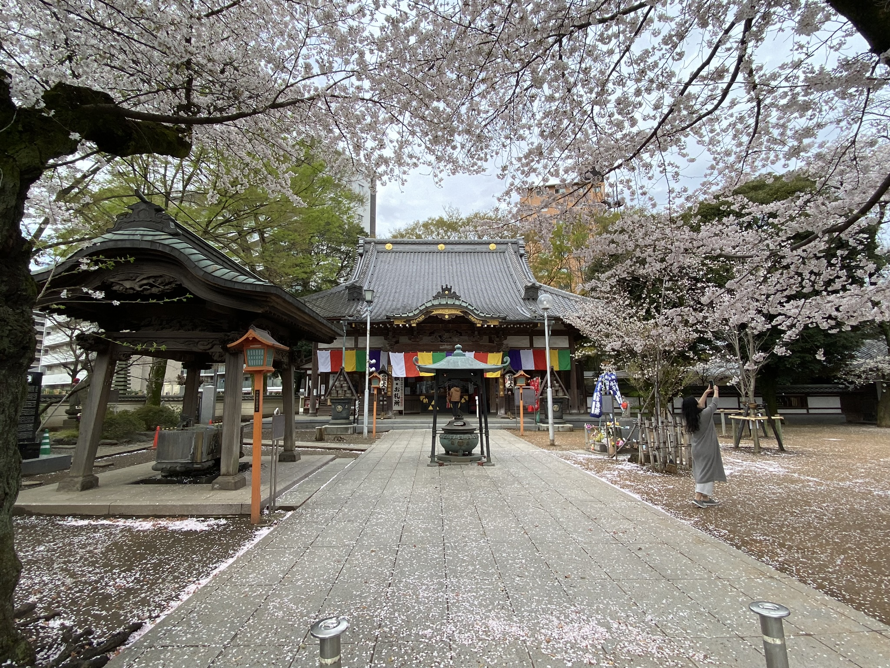
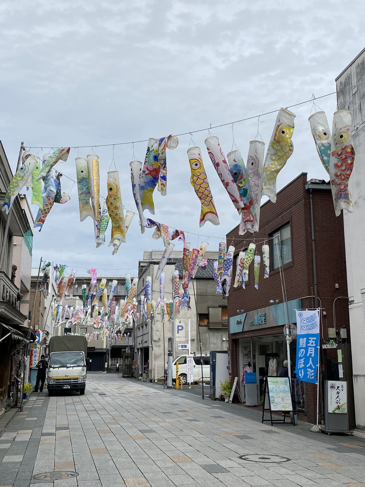
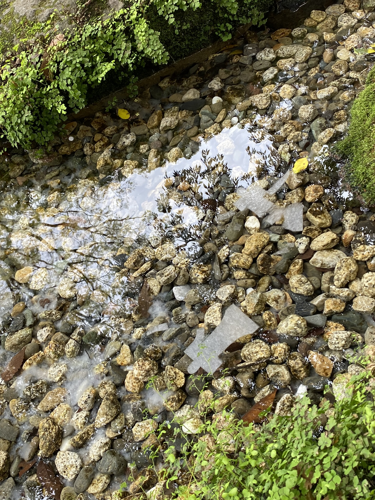

# Cenové šoky, malé Edo a zemětřesení

Koupit letenku, zabalit kufry a na půl roku pápá do Japonska. No, tak jednoduché to nebylo, ale koho to zajímá. Už tu jsem a píšu své první dojmy po první týdnu v nejlidnatějším městě na světě, Tokiu.

I když, ono ty první dojmy nejsou úplně první. V Japonsku jsem už dvakrát byla, tak jsem trochu tušila, co mě čeká. Je ale něco jiného tu být úplně sama a ještě navíc na dlouhou dobu.

Do Tokia jsem přiletěla o týden a půl dřív, než jsem musela/měla, a tedy mám čas se trochu aklimatizovat a rozkoukat. Rouška? Check. Hotovost? Check. Mobil? Check. A může se vyrazit objevovat Tokio. Teda takhle... rouška je od půlky března v Japonsku nepovinná, ale pořád ji tak 80% Japonců nosí. A jako cizinka je pořád lepší udělat dobrý dojem tím, že ji budu nosit.

Doprava v Tokiu je drahá. Jakože, fakt drahá. Problém je, že tu pořádně nemají nic jako naši Lítačku, že si člověk koupí neomezenou jízdenku na měsíc a jezdí si. Tady se sčítá každá cesta a když jedna zastávka metra začíná na nějakých 30 Kč a může se vyšplhat až na 55 Kč jen za jednu linku (cena se odvíjí od ujetých kilometrů), za měsíc se to nasčítá. Druhá varianta je kolo, kterými obecně Japonci žijí, ale zase k velikosti Tokia by se člověk někdy ušlapal... :)

Co člověka (respektive Evropana) může naopak potěšit, je celkem cenově dostupné jídlo. V Japonsku kdejaké konbini (rozuměj sámoška) prodává obento (obědové boxy), polévky co se jen dají do mikrovlnky, nudle, kari, a jiné polotovary, které se ale nevyrovnají těm u nás - tady tyto svačinko-obědovo-večeřové věci prostě frčí. 

Každopádně, pomalu prozkoumávám Tokio i jeho okolí. Za zmínku určitě stojí půldenní výlet do **Kawagoe**, kterému se říká "malé Edo". **Edo** bylo dříve název Tokia, Kawagoe má tedy nádech staršího Japonska. 

V jedné z místních svatyň, **Hikawa svatyně**, jsem provedla rituál s názvem _hitogata nagashi_, jehož účelem je očistit své prohřesky. Třikrát se foukne na washi papír tvaru lidské postavičky _hitogata_, dále se s ní člověk symbolicky otře a se zaříkáváním čtyř slov se pustí po vodě.

A na závěr - zažila jsem první zemětření. Sice jen o síle 1 a asi bych si toho nevšimla, kdybych zrovna neodpočívala, ale zážitek to byl zajímavý. Ale snad jich moc nebude. :D

[Zpátky](./)
