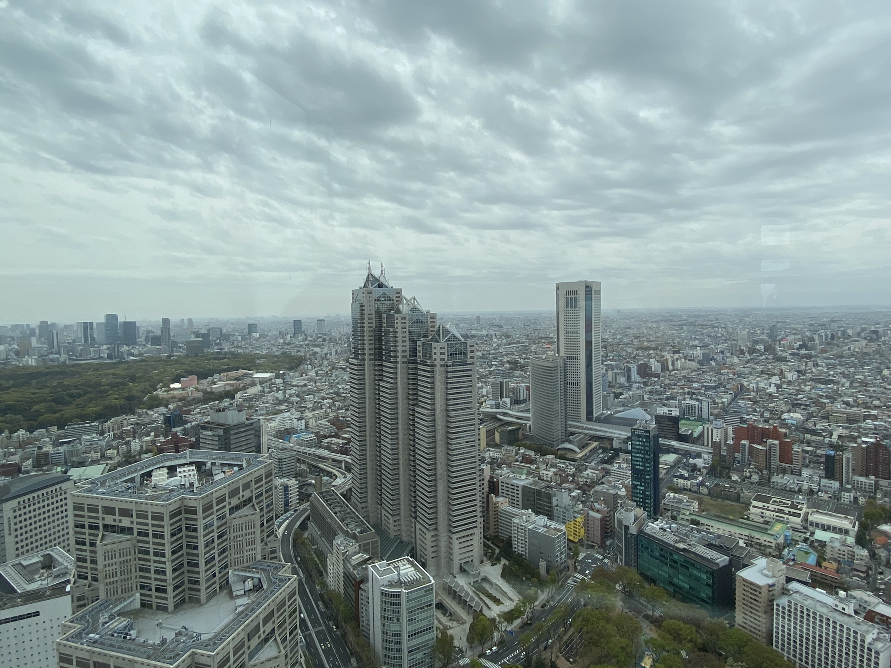

# Výhled z 45. patra, nejfrekventovanější přechod na světě a japonská pošta

* * *

*Shinjuku* 

A na závěr - posílejte z Japonska pohledy/dopisy! Šla jsem poslat jeden dopis do Prahy a stálo mě to v přepočtu 19 Kč. To i Česká pošta si za dopis účtuje 23 Kč. Navíc uděláte někomu blízkému radost!

[Zpátky](./)
