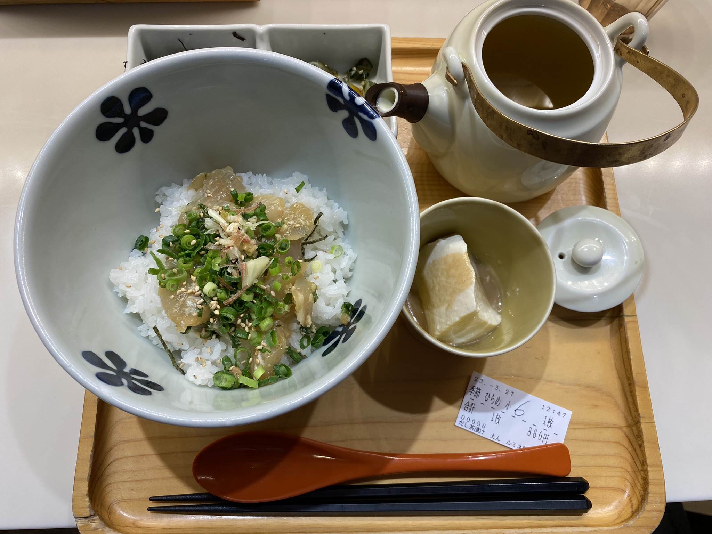
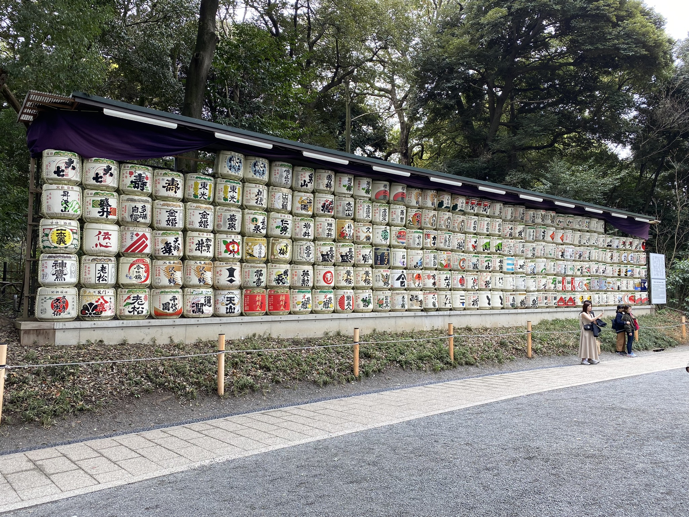
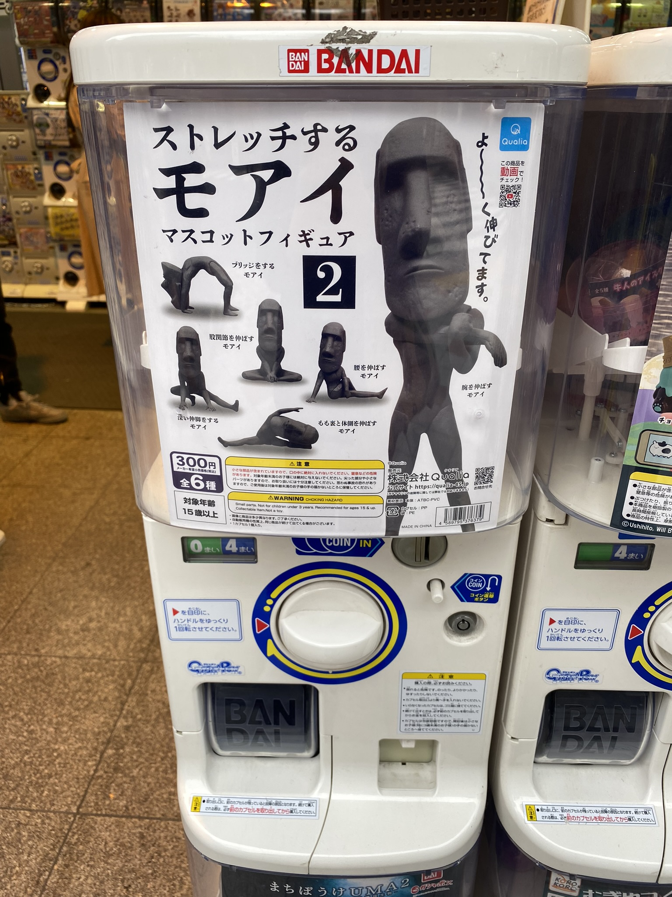

Dnešní moje procházka začínala v **Shinjuku**. Zde se nachází Tokyo Metropolitan Goverment Building, který nabízí zdarma výhled z 45. patra. Člověk si musí trochu počkat (což je v Japonsku zvykem), ale výhled stojí za to! Za lepších podmínek by byla i vidět hora Fuji, já však viděla jen bílou mlhu/smog.Tak třeba příště.

 
 
 Než jsem se vydala dál, zašla jsem na oběd. Vytipovanou restauraci an Ochazuke jsem nakonec našla (člověk se toho v Tokiu nahledá opravdu hodně) a dala si nějakou sezónní specialitu (fakt netuším co to bylo, ale bylo to sezónní, tak proč ne). Ochazuke mě stálo nějakých 150 Kč (na to, že jsem v jednom z center Tokia? Cena dobrá!) a jedná se o jídlo, kde se rýže zalije teplým zeleným čajem. Dobrý to bylo a někdy plánuju zase.
 
  
 
 Pak jsem se pešky vydala do **Shibuya** čtvrti a rovnou to vzala přes **Yoyogi park**. Park je to pěkný, hlavně vyměníte nachvíli zeleň a klid za rušné paneláky a auta. Lidí se tu člověk ale bohužel moc nezbaví - tolik turistických skupinek by mohl závidět pomalu i Pražský hrad. Příště proto možná zkusím zamířit do jiného, byď i menšího, ale lidu-mírnějšího parku.
 Za zmínku z tohoto parku ale stojí staré sudy na saké, kterých bylo tolik, že tvořily celou zeď. Na protější straně cesty pak podobně vyskládané stály sudy vína z Francie.
 
  
 
 V **Shibuya** se nachází nejfrekventovanější přechod na světě, **Shibuya Crossing** (ano, má to i svoje jméno a stránky na Wiki). Bohužel to na mě žádný "Wow efekt" nemělo - asi tím, že člověk, aby se na ten přechod dostal, jich musel projít pár dalších cestou, a i tam bylo hodně lidí. :D Přechod křížem je navíc něco, co je v Japonsku vcelku běžné. A nakonec, ten přechod se ze země fakt blbě fotí. Pokud budu mít zase cestu kolem, plánuju zjistit, jak se dostat do některé z výškových budov kolem, kde by se dala udělat lepší fotka.
 
Hned vedle **Shibuya Crossing** je socha psa jménem **Hachikō**, který přes 9 let chodil čekat na svého páníčka, který umřel v práci, na nádraží. Sochu jsem viděla z dálky a pro teď mi to asi stačí - davy lidí tam byly ohromné. 
 
Tento den jsem také začala svůj "hon za nejdivnější gachapon", ala automaty, kde za pár 100yen mincí vám vypadne jedna z nabízených hraček. Tuto soutěž zatím vyhrává sada figurek protahujících se soch z Velikonočního ostrova. 

 

A na závěr - posílejte z Japonska pohledy/dopisy! Šla jsem poslat jeden dopis do Prahy a stálo mě to v přepočtu 19 Kč. To i Česká pošta si za dopis účtuje 23 Kč. Navíc uděláte někomu blízkému radost!

[Zpátky](./)
