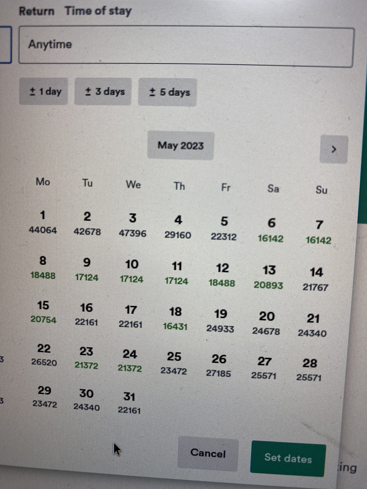
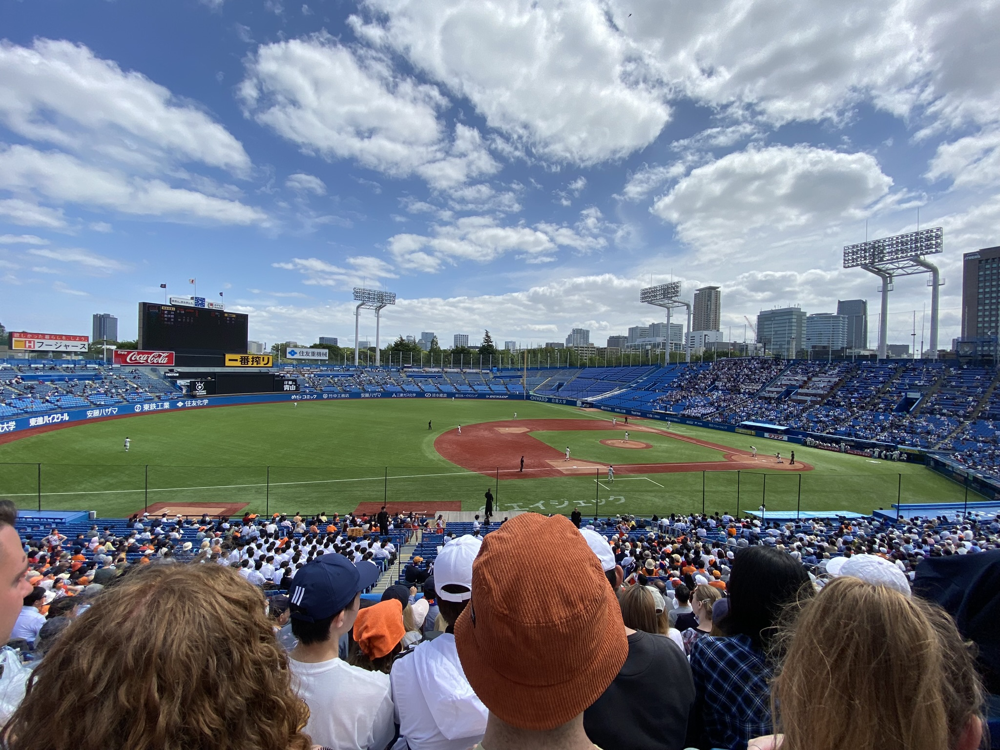
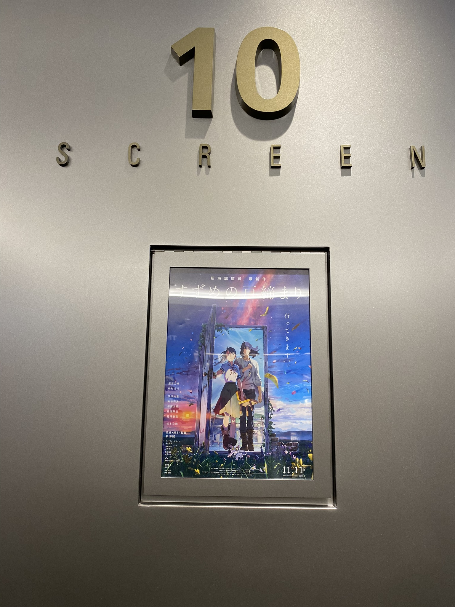

# Golden week část 1, baseball hra, Akabane festival a Suzume no Tojimari

Golden week je týden, kdy se sejde více státních svátků najednou - 29.4. (Den Shōwa), 3.5 (Den ústavy), 4.5 (Den zeleně) a 5.5 (Den dětí) a jak to tak bývá snad všude, většina lidí si vezme volno celý týden a někam vyrazí. A proto je taky během GW často všechno dražší (a zároveň tu jsou "Golden week slevy") a všude mnoho místních, kteří se na týden vžijí do pozic turistů.

Přemýšlela jsem nad last-minute výletem třeba na Taiwan, ale nepřekvapivě byly letenky tento konkrétní týden mnohonásobně dražší.

Na začátku GW byla baseballová hra mezi tokijskými univerzitami, konkrétně mezi **Hosei**, kam chodím, a **Meiji** univerzitou. Vstup jakožto studenti jsme měli zdarma a seděli jsme v oddělené části s týmem roztleskávačů, o kterých jsem zrovna nedávno tady psala. Jelikož jsme se museli částečně zapojovat (stáli jsme vždy když Hosei tým byl na pálce), často bylo velmi složité sledovat vše najednou. 

Hosei nakonec prohrál o jeden bod, ale hra to byla dobrá.

V úterý jsme se vydali do **Akabane** (znaky 赤羽, tedy "červené peří" - no není to hezké jméno? :D) na místní **Akabane Baka Festival**, něco jako aprílový průvod. Bohužel po pandemii to bylo velmi krátké, a tak jsme začali procházet okolí. Za zmínku určitě stojí **Akabane Hachiman Shrine**, která má pěkné výhledy na vlaky!

Prvního května jsme se s Tomomi vydaly do kina (TOHO kina mají prvního v měsíci slevy, ale i tak nás lístek stál 1200 yen (něco přes 190 Kč)) na film **Suzume no Tojimari** - bez titulků. Film jsem hrozně chtěla vidět, ale jako na potvoru jeho českou premiéru ohlásili přesně to samé ráno, co jsem seděla na letišti v Ruzyni a čekala na let do Helsinek. 

Samozřejmě naše úrovně japonštiny zdaleka nestačily na plné pochopení filmu, ale myslím, že tak 70-80% jsme pochytaly (vše až na ta místa, kde vysvětlovali, co se přesně děje :D) a bylo fakt zajímavé po filmu diskutovat co jsme pochopily a co minuly a tak si doplňovaly detaily. Velké plus bylo pro nás i to, že část filmu se odehrávala v Tokiu, dokonce na zastávce **Ochanomizu**, která je známá pro sledování vlaků, a kteoru každý den jezdíme do školy.

Hodně se mi líbil koncept filmu a děj a jeho reference na skutečné události a japonský folklór. Ve filmu byla reference (ne přímo řečená, ale dost očividná) na velké zemětření v **Tóhoku** v roce 2011, kde ve filmu hlavní hrdinka ztratila maminku. Děj se odehrává po různých místech v Japonsku, především kde byla nějaká velká zemetřesení (třeba v Tokiu přesně před 100 lety), a končí právě v Tóhoku. 

Věřím, že film musel být velmi silným zážitkem pro lidi, kteří toto zemětřesení sami zažili. Bylo vidět, že film se snaží pomoct se zármutkem a jak je důležité mít odvahu vyslovit svoje pocity (což Japonci obecně neumí).

Film budou dávat i v českých kinech a doporučuji! Kdyžtak český trailer je zde: [Odkaz](https://www.youtube.com/watch?v=ctFsBSS5jIA)

Mimochodem, na filmu spolupracoval i pražský sbor! Byli v titulkách na konci filmu.

[Zpátky](../)
