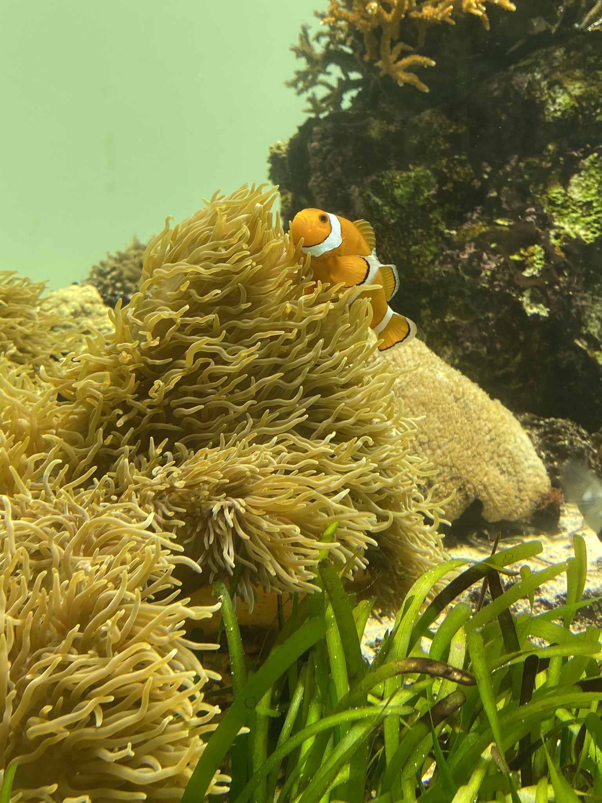

# Golden week část 2, Yosakoi festival, mořský svět a piknik

Uprostřed Golden Weeku jsem se s japonskou kamarádkou Haruna vydala do města **Kisarazu**, který leží mimo Tokio na druhé straně mostu linoucího se přes Tokijský záliv, kde se ten den konal yosakoi festival **木更津舞尊** (**Kisarazu Buson**) [Odkaz](https://kisacon.com/2023/01/22/yosakoi2023/).

Ještě před začátkem jsme prošly okolí a nejenže z dálky viděly horu Fuji, na místě se zrovna konal i sběr měkkýšů, mušlí, škeblí a kdo ví čeho, což má i název v japonštině: __shiohigari__.

Samotný festival jsme si užily, i když bylo dosti vedro. Každý tým byl něčím zajímavým a i když mám své favority, líbily se mi všechny.
Přestože mám sama pár videí a fotek, dávám sem seznam na celé tance na ukázku (točených v Kisarazu):

[REDA舞神楽](https://www.youtube.com/watch?v=hbPpsZKETqU).

[維新～心ひとつ～](https://www.youtube.com/watch?v=Jom69NxXi90).

[木更津舞踏団 舞猿](https://www.youtube.com/watch?v=yJ3o5Xh-ae8).

[七福よさこい連 祝禧](https://www.youtube.com/watch?v=Ic40fzQYbcE).

[輝翔連](https://www.youtube.com/watch?v=XMmK_AEQYxs).

Ve čtvrtek jsme s kamarády z kolejí v **Kasai** využili vstup zdarma do vodního světa **Tokyo Sea Life Park** v **Kasai Rinkai Park**. I když bylo místo veeelmi narvané a plné dětí, den to byl super a zakončili jsme ho piknikem v parku poblíž.

V akvárku nechyběl ani Nemo!

[Zpátky](../)
