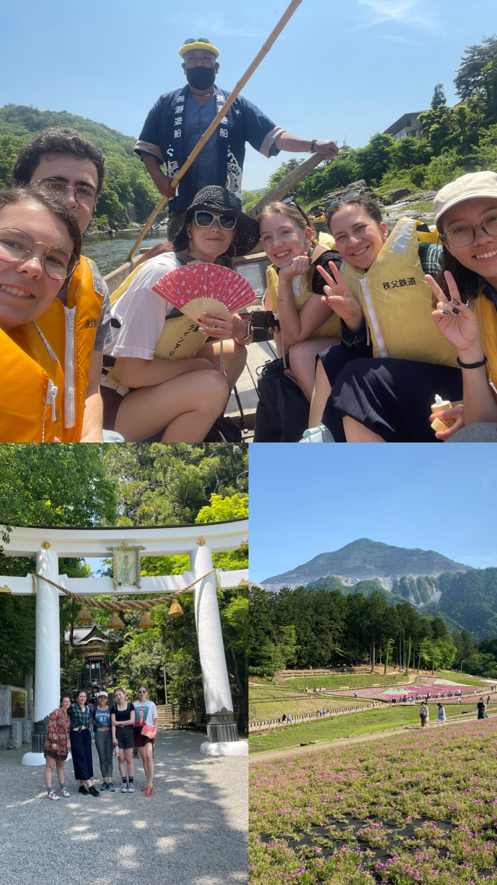

# Golden Week část 3, příroda v Chichibu, Gundam robot a Socha Svobody 

Kvůli počasí jsme trochu prohodili plány a v pátek vyrazili do Chichibu. Jedná se o místo kousek za Tokiem, kde je hezká příroda. Původně jsme plánovali rafting, bohužel bylo málo vody, tak jsme využili menší prohlídkové jízdy (která byla až moc krátká a trochu rip-off, ale byli jsme tam jediní cizinci, takže rip-off to bylo pro všechny :D), navštívili svatyni, kde jsem snad poprvé měla v omikuji __daikichi__, tedy velké štěstí, a nakonec se přemístili do parku, který na jaře krásně kvete, my však toho období o pár dnů prošvihli. Celkově navíc bylo takové vedro, že jsem se už podruhé co tu jsem spálila. Každopádně, i když to byl částečně nevydařený den co se týká plánů, ve výsledku to byl fajn den.

(Na fotce nahoře zleva Amelie s jejím přítelem, Elizabeth, Charlotte, já, Tomomi.)

I přes únavu jsem další den vyrazila na umělý ostrov v Tokijském zálivu **Odaiba**, který slouží jako zábavné centrum. Důvod byl ten, že tam celý týden probíhal festival **Furusato**. Jednalo se o akci, kdy tam každý den byly ukázky z festivalů po celém Japonsku. Já si vybrala den s ukázkou **Bon Odori**, **Nebuta** festivalu z **Aomori** a **Yosakoi festivalu** z **Kóči**. 

Bon Odori je jednoduchý tanec, který se dá tancovat do kolečka - což jsme si taky na této akci zatancovali. Tedy, ti odvážnější. Mám pocit, že více lidí nás fotilo, než aby se přidali. 

Nebuta festival z Aomori je festival v srpnu, který jsem hrozně chtěla navštívit, bohužel jelikož se jedná o menší město, ubytování jsou už kompletně pryč. Tak jsem menší ukázku měla alespoň tady.

Odaiba samotná je zajímavé místo, skutečné centrum zábavy. Spoustu zajímavých (a dražších) obchodů, několik zábavných center a mimo jiné i japonská Socha Svobody a velký Gundam robot! Ten navíc lehce zasvítí a zahýbe hlavou co celou hodinu.

Nakonec přidávám jednu hezkou fotku náhodně objevené ulice, která byla nádherně vyzdobená na Den dětí.

[Zpátky](../)
