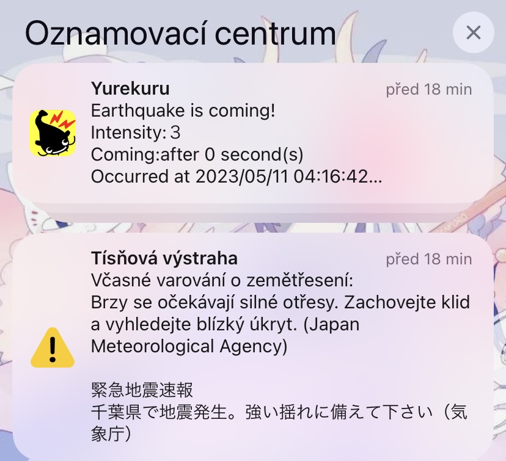
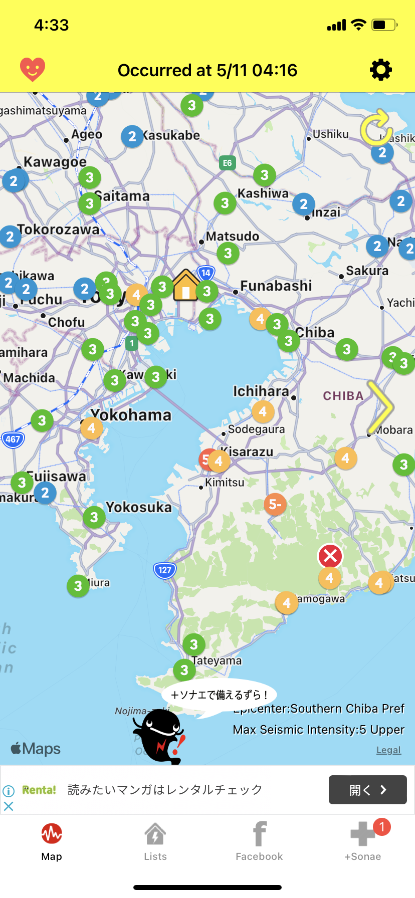

# Návrat do školy, alarm v půl 5 ráno a školní tělocvična

Návrat do školy po týdnu volna byl, jak je zvykem, lehce krušný. Poslední dva dny spíše pršelo, tak jsem doháněla úkoly. 

Jelikož plánuji s kamarády navštěvu Ghibli muzea, desátý den v měsíci v deset hodin jsem seděla ready u počítače, koupit lístky na další měsíc. Co jsem ale netušila byl ten obrovský zájem, když mi stránka řekla, že je přede mnou přes 7 000 lidí a že budu čekat přes hodinu. Po pár minutách, když jsem viděla, že se fronta nehýbe, jsem zkusila navštívit jejich japonskou verzi stránek. Světe div se, v japonštině tam žádná fronta nebyla a lístky jsem měla rezervované hned. Bylo to tím, že v této druhé verzi člověk buď musí vlastnit japonskou kartu, nebo být schopen si do 3 dnů lístky v Japonsku vyzvednout osobně. Já mohla to druhé, a hned ten den si lístky v náhodném Lawson konbini vyzvedla. 

Středa desátého byla zajímavá i v něčem jiném - během dopolední japonštiny jsme zažili menší zemětřesení o síle 2. Vyjukaná jsem lehce byla, ale výuka pokračovala dál jakoby se ta tabule vůbec nehýbala. Ještě zajímavější situace ale nastala v noci na čtvrtek, kdy v půl páté ráno vzbudily většinu lidí na koleji alarmy z mobilů, jeden mi taky u ucha zazněl. Ve městě za Tokiem, Chiba, bylo zemětřesení o síle 5, přičemž k nám se dostala síla 3. Upřímně, šla jsem ten den spát pozdě a zemětřesení přišlo v tu nejhorší noční hodinu, že když jsem se vzpamatovala z toho, co že mě to vlastně vzbudilo, že některé holky na chodbě sice jančí, ale vlastně to zemětřesení tak silné není, i podle dat z aplikace Yurekuru, ulehla jsem zase zpátky do pelech.

Notifikaci jsem měla jak od iPhonu, tak i od aplikace **Yurekuru**, kterou Japonci používají právě pro zemětřesení. "Yure" znamená otřesy a "kuru" přijít. V logu aplikace je sumec, neboť se dříve v Japonsku věřilo, že pod zemí žije obrovský sumec **Namazu**, který je strůjcem zemětřesení. Tato teorie nabila velké popularity v roce 1855, kdy Japonsko, konkrétně Edo (tedy dnešní Tokio), zasáhlo silné zemětřesení o síle 7 (škála se v Japonsku pohybuje od 0 do 7) a přineslo mnoho obětí. Jelikož ve stejné době byla populární malba a ukiyo-e, Namazu se začal objevovat v umění, že toto umění dostalo i název **namazu-e**, a říkalo se, že obraz v domě ochrání před dalším zemětřesením. 

V aplikaci Yurekuru jsem pak mohla vidět reakce lidí (jaká byla pocitová síla), tak i reálná čísla. 

Sumec ve spojistosti se zemětřesením přetrval do dnes - na silnicích existují __Emergency road__, které jsou uzavřeny v případě silných zemětřesení, a na cedulích je spolu s popisem vyobrazen právě sumec. Více třeba tady: [Odkaz](https://sabukaru.online/articles/namazu-the-ancient-history-behind-the-earthquake-causing-catfish)

Jedna z věcí, co mně i ostatním ESOP studentům celkem chybí, jsou naše pohybové aktivity. Takže občas navštevujeme školní posilku a nebo nás kamarádka učila základy na provazu či akrobacie. Taktéž jsme navštívili trénink karate klubu.

[Zpátky](../)

