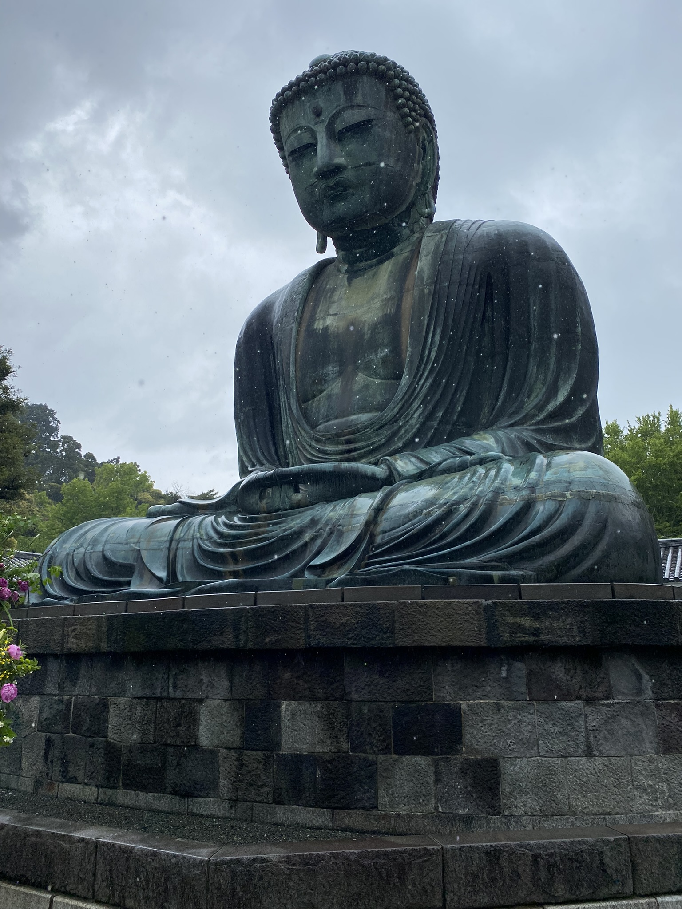
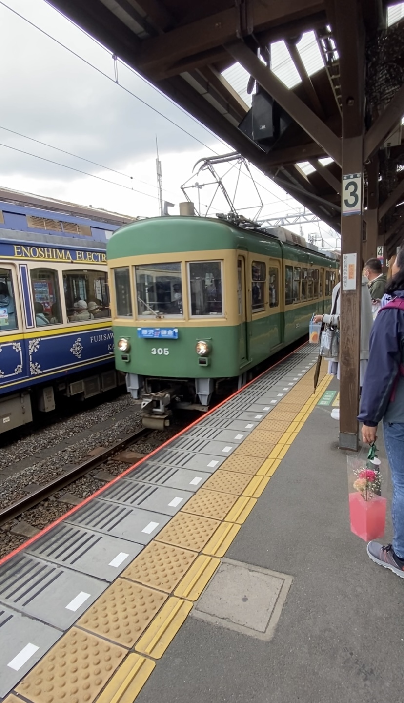
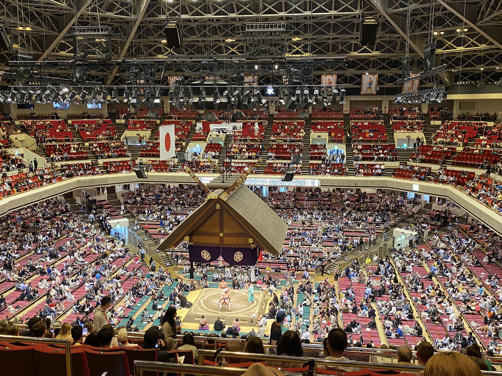
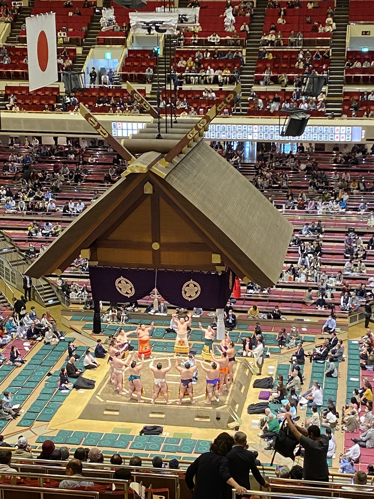

# Velký dutý Buddha, průvody nošených svatyň a sumo turnaj

O městu **Kamakura** a jemu blízkému ostrovu **Enoshima** jsem slyšela hodně od lidí kolem, kteří místo již navštívili - že prý se jedná o jedno z nejlepších měst kam vyrazit na jednodenní výlet z Tokia. Já se tam nakonec s jednou kamarádkou, Japonkou Miki, taky vydala.

Jako první jsme navštívily rozlehlou svatyni **Tsurugaoka Hachimangu**, od které jsme to prošly až na místo, kde je se nachází velká socha **Amida Buddhy**. Ta je dle Wikipedie dokonce druhou největší v Japonsku, hned po soše ve městě Nara. Dokonce se šlo podívat i dovnitř do této duté sochy, ale vnitřek byl prostě to co byste od duté sochy čekali.

Poblíž jsme také zašly do **Hasedera** chrámu, který je obklopen nádhernou zahranou a mnoho cestičkami se soškami a jinými buddhistickými výjevy. Je odtamtud také pěkný výhled na moře a město. Byly tam i tyto roztomilé sošky. 

Tyto sošky jsou **Jizo Bosatsu** (buddhištiční mnichové), které mají chránit děti a cestovatele, a jsou vyrobeny z kamene, který má mít spirituální sílu ochrany a dlouhověkosti.

Místním lokálním vlakem jsme se přemístily o pár zastávek dál k mostu vedoucímu na Enoshimu. Samotný vlak a jeho trať rozhodně stojí za zmínku - jezdí podél pobřeží a uzkými uličkami mezi domy a myslím, že je to zážitek nejen pro vlakové nadšence.

My navíc měli štěstí a jely nejstarším možným vagónem - s dřevěnou podlahou! Cesta zpátky byla taky zajímavá, protože v půlce cesty se vlak v půlce rozdělil a do cíle pokračovaly jen poslední dva vagóny. Bylo zajímavé poslouchat, jak ve vlaku hlásí, ať jdeme do prvních vagónů, že poslední pokračovat dál nebudou.

Místo je oblíbené i mezi Japonci i díky tomu, že se na místě odevrával děj úspěšné sportovní mangy o basketballu Slam Dunk - [Odkaz](https://www.google.co.jp/search?q=slam+dunk+kamakura&tbm=isch&ved=2ahUKEwi30cSkqfz-AhV0m1YBHWxDBdYQ2-cCegQIABAA&oq=slam+dunk+kamakura&gs_lcp=CgNpbWcQAzIHCAAQExCABDIICAAQCBAeEBM6BwgAEIoFEEM6BQgAEIAEOgQIABAeUPwDWMoQYO8RaABwAHgAgAGOAYgB4giSAQQwLjEwmAEAoAEBqgELZ3dzLXdpei1pbWfAAQE&sclient=img&ei=UcRkZPfkEPS22roP7IaVsA0&authuser=0&bih=936&biw=1848&hl=cs)

Enoshima je krásný malý ostrov a jelikož je to hned vedle moře, je zde mnoho restaurací a obchodů s mořskými plody a rybami. I my zašly na oběd, já si dala lososa s rýží posypanou shirasu (maličké rybičky) a onsen vajíčkem (typ soft-boiled vajíčka) a bylo to opravdu vynikající.

V neděli se konaly hned minimálně 3 festivaly (o kterých jsem věděla), stihla jsem ale "jen" 2. I ty však stály za to.

První byl **Kanda festival**, jeden ze 3 největších festivalů

Druhý, který jsem stihla navštívit, byl **Chestnut festival** v Asakusabashi

V pondělí jsme vyrazili do **Ryogoku** stanice, kde je sumo aréna. Měli jsme totiž lístky na druhý den zápasů **Grand Sumo Tournament 2023**. Zápasy začínaly začátečníky, po obědě pokročilí a odpoledne ti nejlepší. Bylo zajímavé sledovat, jak se v průběhu dne aréna plnila lidmi, slavnostní rituály před zápasy prodlužovaly a zápasníci přibývali na váze.

Před každým zápasem vždy bylo prohlášeno kdo zápasí, oba sumo zápasníci pak provedli rituály zvednutí a dupnutí nohama, otočení rukama na ukázku že nemají v ruce žádnou zbraň, a pokročilí zápasníci i házeli solí. Toto u těch nejlepších trvalo i pár minut - jen aby skutečný zápas skončil v řádech vteřin, nejvýše desítek vteřin.

Osobně mě to ale hodně bavilo. Byly to rychlé zápas a napínavé. Když byl zápas nerozhodný, jeden z 5 soudců sedících kolem kruhu zvedl ruku a všichni se sešli uvnitř kruhu, aby zápas prodiskutovali. Pak probíhalo buď vyhlášení vítěze nebo se zápas opakoval. Také poté pokaždé vyslovili se jménem vítěze i technik, která vedla k vítězství. Hodně užitečná byla [tato](https://sports.japantimes.co.jp/sumo/techniques.html) stránka a bavilo mě si techniky buď hledat nebo tipovat, když jsem tušila, že co techniku jsem právě viděla.

[Zpátky](../)
