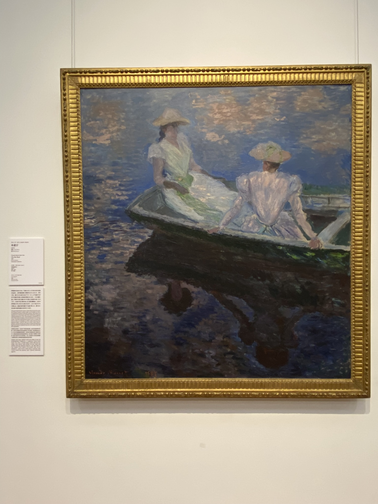
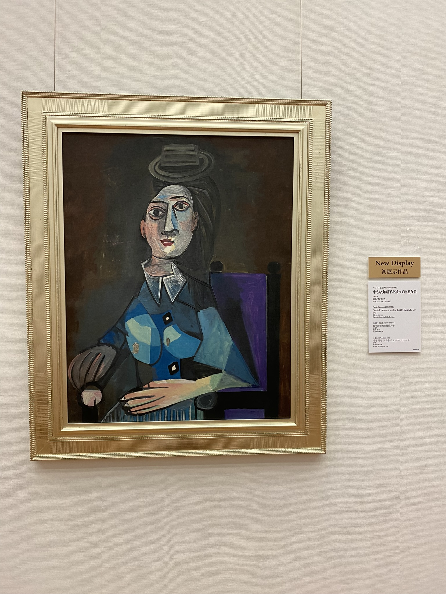

# Picasso v Tokiu, 

Dne 18.5. jsme využily na návštěvu muzeí v Ueno parku, jelikož ten den byly zdarma. Zašly jsme do **National Museum of Western Art** a **National Museum of Nature and Science**. 

U muzea západního umění mě překvapilo, že měli (sice jen pár kusů a méně známá, ale i tak) díla od umělců jako jsou Picasso, Monet....

O muzeu vědy a přírody upřímně nevím moc co si myslet. 

[Zpátky](../)
