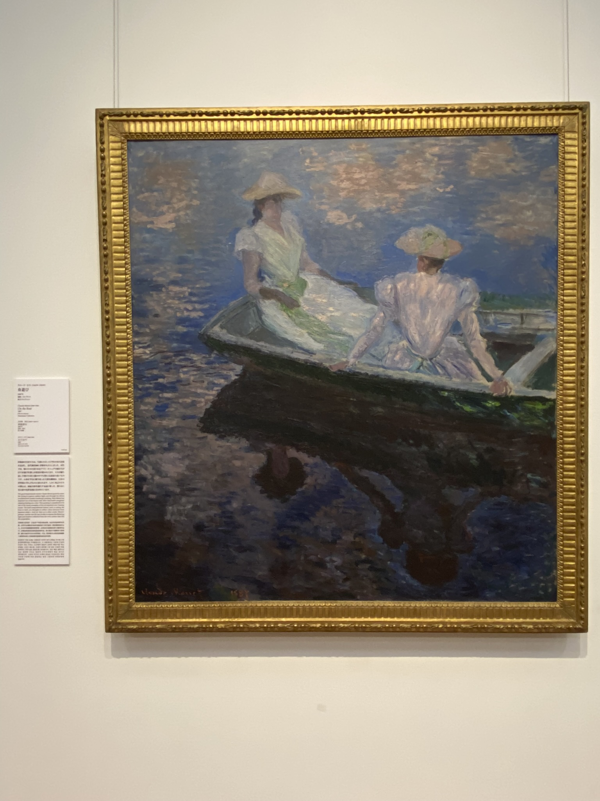
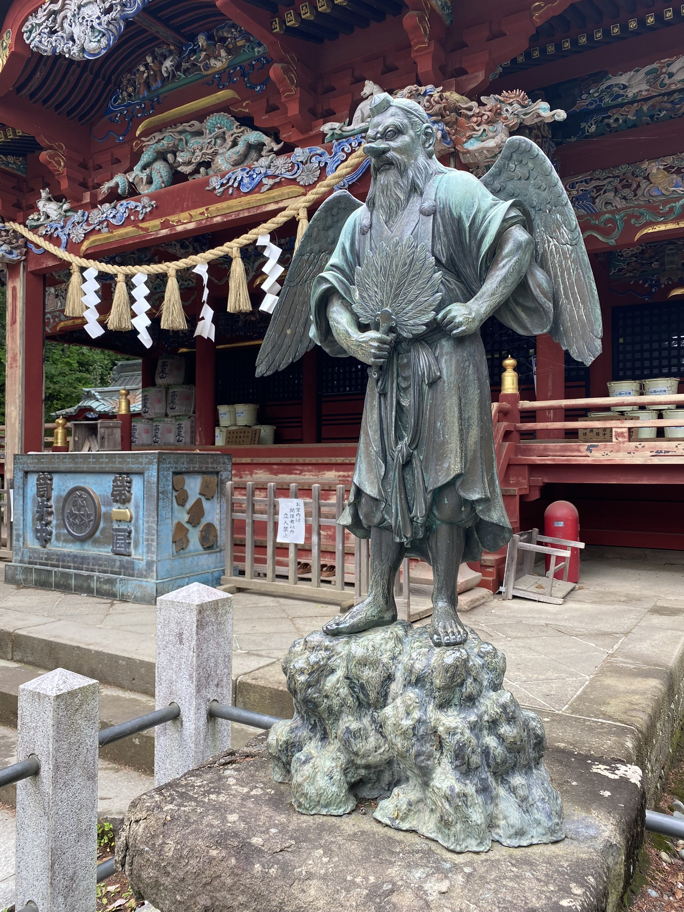
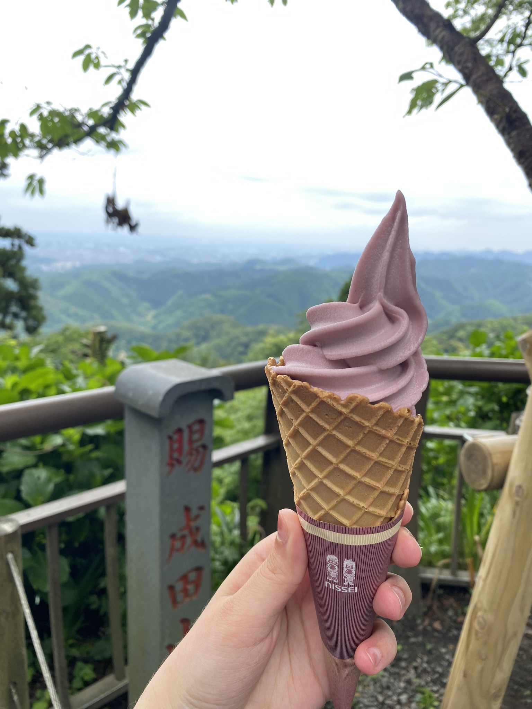
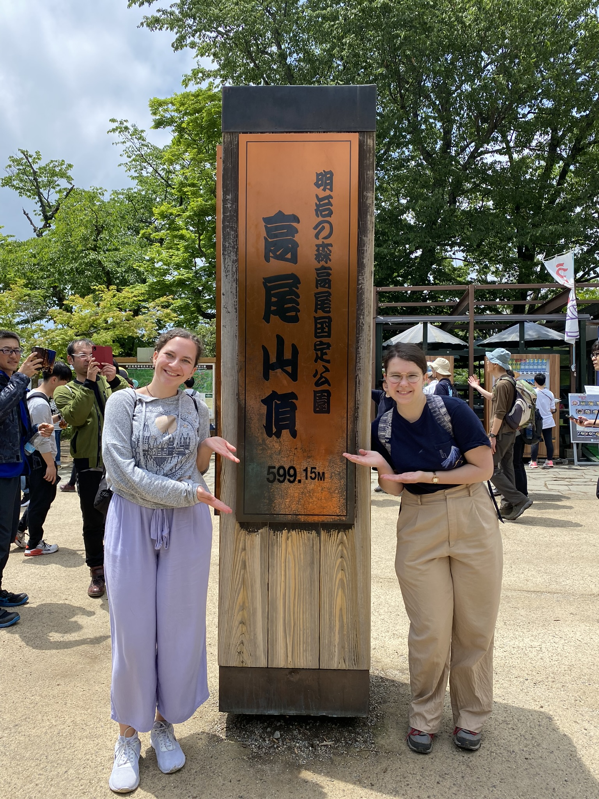
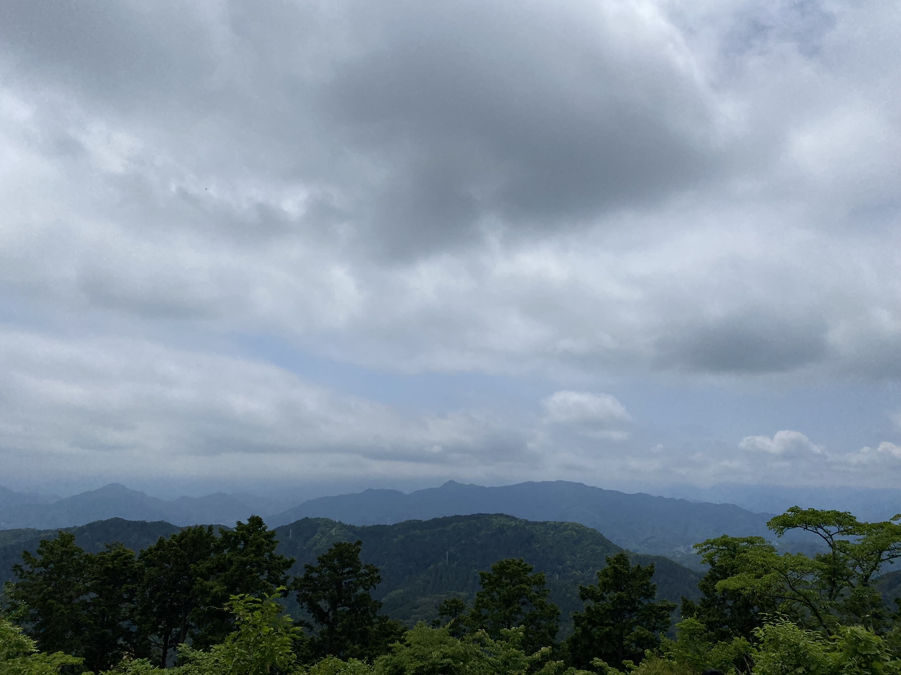
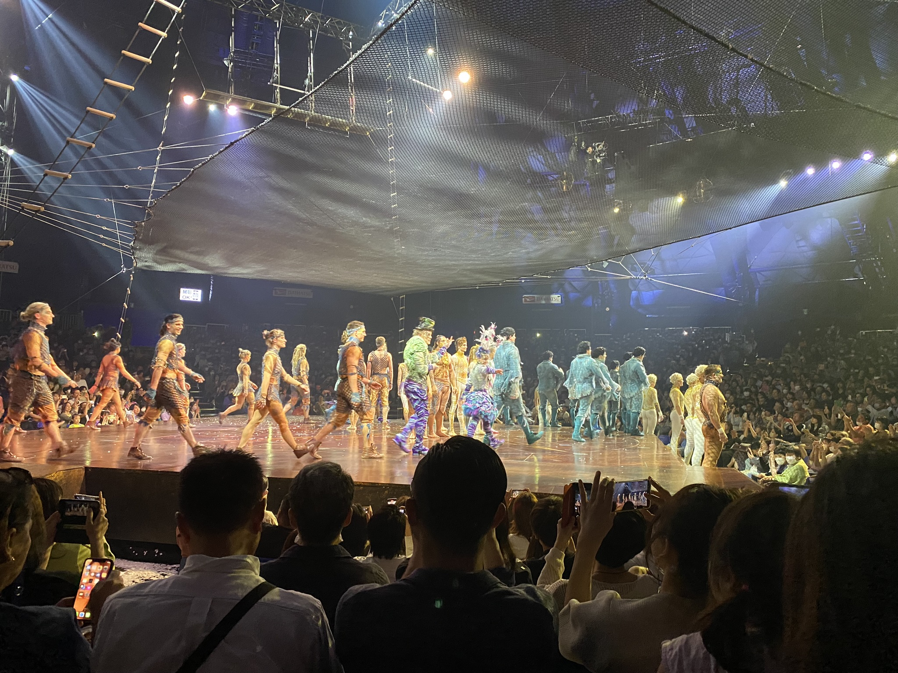
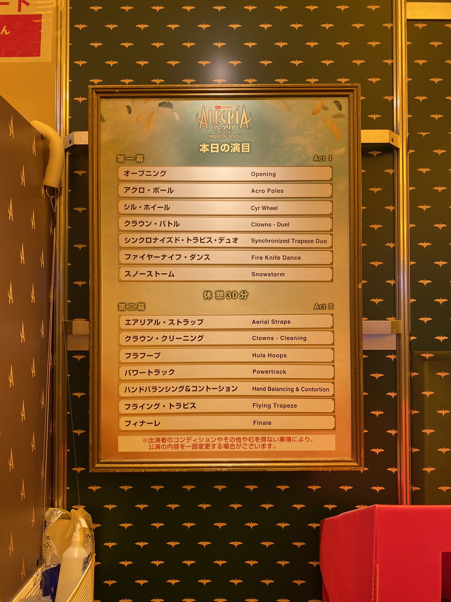
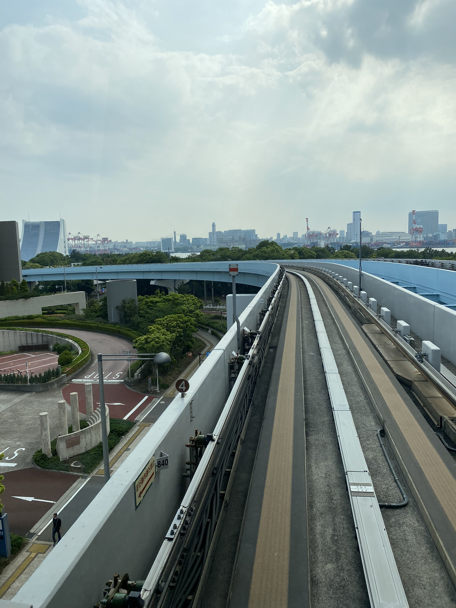

# Picasso v Tokiu, nejnavštěvovanější hora na světě, a Alegría od Cirque du Soleil

Dne 18.5. jsme využily na návštěvu muzeí v Ueno parku, jelikož ten den byly zdarma. Zašly jsme do **National Museum of Western Art** a **National Museum of Nature and Science**. 

U muzea západního umění mě překvapilo, že měli (sice jen pár kusů a méně známá, ale i tak) díla od umělců jako jsou Picasso, Monet nebo Vincent van Gogh. Obecně myslím, že pro Evropany to není nic nového, ale zdarma proč ne. 

O muzeu vědy a přírody upřímně nevím moc co si myslet. Vizuálně je to moc pěkné a velké, ale to protože je tam mnoho plastových replik zvířat, koster apod. Jakožto dospělý člověk bych radši uvítala vizuálně méně zajímavé, ale opravdové věci, každopádně myslím, že pro rodiny s dětmi to určitě stojí za to.

V neděli jsem se s Amelie vydala na **horu Takao** - některými stránkami označována jako nejnavštěvovnější hora na světě, hodinu od centra Tokia, s výškou 599 metrů.

Pro tuto horu je typické hned několik věcí: tengu, opice, lokální speciality a lanovky.

Tengu jsou japonská nadpřirozená stvoření, která jsou označována jako typ youkai (strašidel/démonů) a zároveň až jako šintoištičtí bohové. Žijí v lese, mají křídla a dlouhý nos nebo zobák a v rukách vějíř. Názor na ně se postupem času měnil, takže jsou označována jako stvoření dobrá i zlá, jako démoni i jako bohové.

Nejvíc byli tengu v chrámu **Takaosan Yakuōin Yukiji**, který byl velký a fakt pěkný. Měli tam mnoho buddhistických prvků, co se jen tak někde v chrámech nevidí. Bohužel ale nejsem v chrámech tak znalá, abych dokázala vysvětlit, k čemu jednotlivé prvky byly. A mě stejně nejvíc zaujaly sochy tengu, nejhezčí za mě byli tito:

V tom samém chrámu byl stánek s jednou lokální dobrotou, a to zmrzlinou s příchutí hroznového octu. Na plakátu měli napsáno že je "sladko-kyselá", mně přišla jako sladká s příchutí hroznu s další příchutí, co jsem moc netušila k čemu přiřadit. Kamarádce to přišlo jak hroznová sodovka. Doporučuji, ale asi jedna stačila.

A tady jedna fotka na vrcholu jako důkaz, na kterou jsme si museli vystát frontu. :D

Výhledy byly hezké, ale na horu Fuji bylo moc oblačno.

Cestou dolů jsme se ještě stavili v "parku opic". Bohužel očekávání byla trochu jiná a ve výsledku to byla spíše ZOO jen s jedním druhem opice. Ale byl čas oběda a jeden pán tam vyprávěl o chování těchto opic, že jsem se i něco dozvěděla. 

Nakonec jsme výlet završily tím, že jsme horu sjely lanovkou dolů, a cestou měly pěkné výhledy. I když více jsme se bály toho, aby nám něco neupadlo. :D

V pondělí jsme se vydali do cirkusu - a to na ten prý nejlepší, **Alegría** od **Cirque du Soleil!** Pro zajímavost či porovnání, lístek v předposlední kategorii nás stál 9000 jenů (cca 1450 Kč), a seděli jsme sice hodně z boku, zato ale dle mě hodně vepředu. Fotit se až na finále nemohlo, tak přidávám sice horší, ale jednu fotku.

Trailer je úchvatný a doporučuji si ho zhlédnout! [Trailer zde.](https://www.youtube.com/watch?v=snZ1yDnVhfU)

A zajímavý fakt na závěr, cirkus byl na ostrově Odaiba, o kterém jsem už psala dříve, ale tentokrát jsem na ostrov přijela linkou **Yurikamome**, která nemá řidiče, ale vše je naprogramováno. Je odtamtud hezký výhled, neboť to i jede přes řeku, a výhled v prvního vagónu je dle mě nejlepší.

[Zpátky](../)
