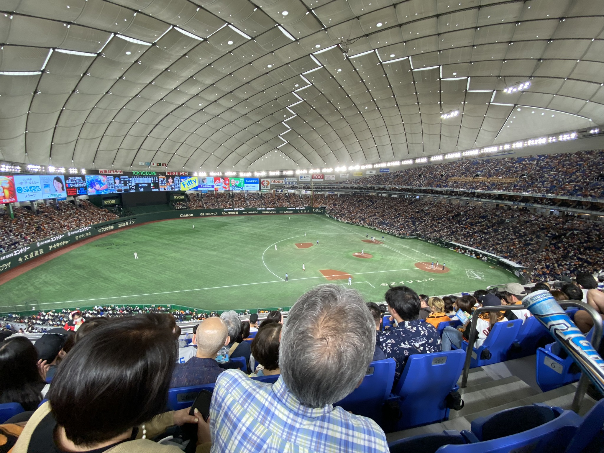
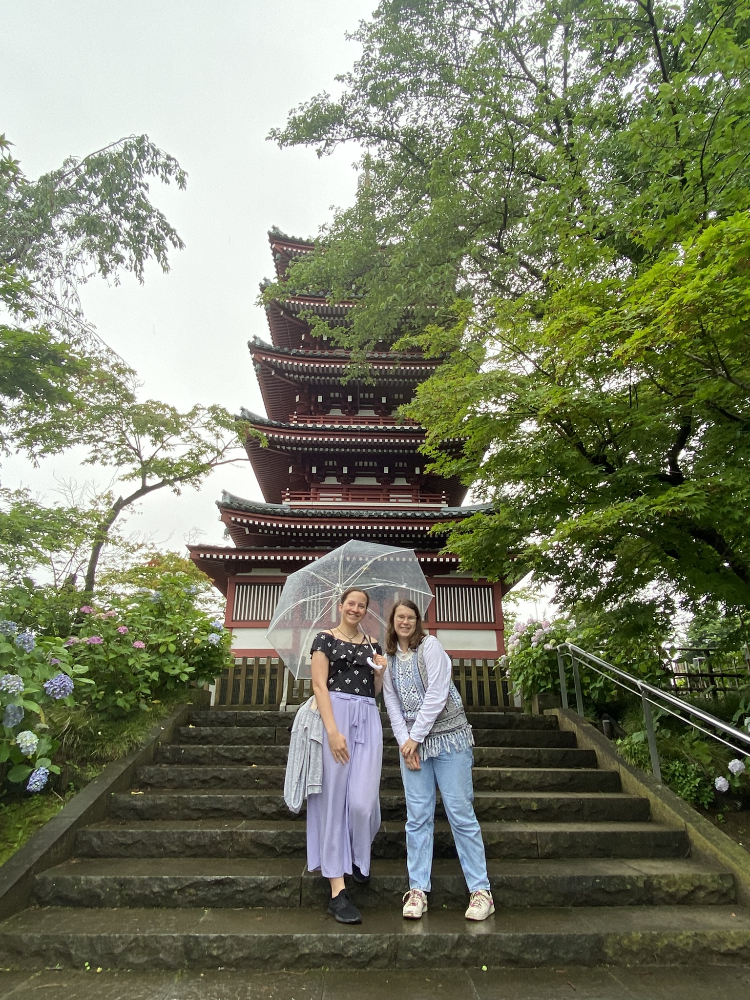

# Noční Asakusa, shabu-shabu a okolí Tokyo Tower

Zatímco denní **Asakusu** kvůli návalu turistů moc ráda nemám, noční Asakusa je něco úplně jiného. Od setmění do přibližně 11 večer je celý **Senso-ji chrám** nádherně nasvícený, obchody zavřené, a sice se tu turisti stále najdou, ale mnohem, mnohem méně. (Zato narazíte více na opilé Japonce :D.)

A nejen tento chrám, ale i nedaleko stojící a z Asakusy krásně viditelná **Tokyo Sky Tree** taky přes noc září všemi barvami. Procházka podél řeky **Sumida**, která protéká hned vedle Asakusy, je taky top. Mosty byly hezky nasvícené. Určitě doporučuji!

Jelikož se blížila půlka semestru, blížily se i midterm projekty a testy. Testy jsem měla naštěstí jen z japonštin a na ostatní předměty "jen" nějaké projekty. Každopádně, sezení ve 25. patře (26F) nejvyšší budovy Ichigaya kampusu s výhledem na Tokio posouvá učení na úplně jinou úroveň.

O víkendu jsme zašli na **shabu-shabu**. Jedná se o japonský hotpot. Na stole před námi byl nízký hrnec s omáčkami, ve kterých si člověk vaří tenké plátky nakrájeného masa a zeleniny. Měli jsme all-you-can-eat a abych řekla pravdu, nejlepší tam byla zmrzlina a japonská ledová tříšt kakigouri.

Po tomto vydatném obědě jsme se vydali na procházku k **Toyko Tower**. Tokyo Tower i její okolí je hezké, každopádně jak jsem si už zvykla na Tokyo Sky Tree, mám ji nějak radši. 

Poblíž byl i velký chrám, **Zojo-ji**, který se ale z části rekonstruoval (pro lepší ochranu při zemětřesení) a osobně mi nijak zvlášť zajímavý nepřišel, ale bylo možné si ho vyfotit s Tokyo Tower v pozadí.

Nejzajímavější byly vedle chrámu stojící malé sošek, které slouží jako bůžči pro ochranu dětí. Jsou zasvěceni zdravému růstu dětí i vnoučat, ale i jako memoriál pro nedonošené či z jiného důvodu nenarozené děti. Mají červené čepičky proti zimě, červenou zástěrku a větrník. A bylo jich tam opravdu hodně.

Další den se konalo pár menších festivalů/akcí, já zašla například na vystoupení **bubny taiko** - i když to byl vysokoškolký klub, byly opravdu dobří a velmi synchronizovaní.

[Zpátky](../)

# Císařské zahrady, muzikál Heathers a Tokyo National Museum

Jedna ze svatyň poblíž školy, **Tokyo Daijingu**, měla malou akci sbírání QR kódů v okolí, kdy jste za ně mohli dostat tenhle hezký pin, tak jsem si pro jeden taky zašla.

Poté jsem to prošla do **Kitanomaru National Garden**, **The East Gardens of the Imperial Palace** a **Kokyo Gaien National Garden**, vše parky kolem **Kókjo**, hlavního sídla japonského císaře. Přestože tyto zahrady byly zadarmo, do části s císařským palácem se může jen v rámci komentované prohlídky, která je sice taky zdarma, ale jen dvakrát za den a všechny časy jsou už beznadějně zarezervovány. Samotné okolní zahrady jsou pěkné, i když z mého pohledu nic extra. Odpočinete si od přeplněného centra, neboť ty zahrady jsou velmi rozlehlé, ale také působí až trochu pustě. Každopádně pěkné jsou!

Ve čtvrtek jsem měla možnost vidět jeden známý muzikál, Heathers, v podání vysokoškoláků a jiných. Měli to moc povedené, třeba živou kapelu jsem nečekala. Angličtinu měli buď hodně dobrou (asi vyrůstali v zahraničí) nebo se silným přízvukem (asi vyrůstali v Japonsku). Celkově mě ale představení velmi mile překvapilo. 

A pak mi samozřejmě několik dní v hlavě hrála písnička Candy Store (ta melodie je prostě mega chytlavá).

O víkendu jsme v rámci hodiny Visual Arts in Japan zašli do **Tokyo National Museum** v **Ueno parku**, který jsme měli jakožto studenti Hosei Univerzity zadarmo. Museli jsme v rámci mid-term projektu si vybrat pár děl a napsat o nich více. Tak přidávám alespoň pár ukázek.

Jednoho večera jsem náhodně začaly s holkama na koleji téma pasů a pak je začaly porovnávat. Například existují 4 barvy pasů, a barva trochu souvisí s historií. Každé pasy mají různě více či méně detailní stránky pro lepení a psaní víz. Nejhezčí pas má stopro Austrálie!

[Zpátky](../)

# Tajfún, profesionální baseball a čtvrť sekáčů

Dne 2. června 2023 se k Japonsku přiblížil tajfún. Šel sice podél Japonska, jeho vliv byl ale dost poznat - velmi silný vírt a velmi silný désť. 

Vlaky samozřejmě nabíraly zpoždění, na druhou stranu, být tohle Česko, tak ty vlaky ani nevyjedou.

No a co by to bylo za tajfún bez budíčku ve formě Tísňových varování (která mimochodem chodí jen na iPhony?). A nejlépe ve 3 a ve 4 ráno. A nejlépe ještě taková, která se nás ani netýkají. Respektive, to první ve 3 ráno varovalo před záplavy, které sice byly, ale jinde, než kde bydlíme. No a to druhé ve 4 ráno byla jen zpráva o tom, že v Edogawa-ku, kde bydlíme, žádné větší nebezpečí nehrozí. Ale prostě jsme to asi museli vědět ve 4 ráno. A navíc to poslali jen v japonštině. Well, začínám si na ten zvuk budíku nějak zvykat. :D

V neděli 4.6.2023 jsem měla šanci jít na baseballový zápas - domácí Tokijští GIANTS proti FIGHTERS z Hokkaida. Zápas se konal v **Tokyo Dome** na zastávce **Suidobashi**, takže jsem byla velmi nadšená, že můžu stadión vidět zevnitř. A impozantní rozhodně byl! Jen teda domácí GIANTS, jejichž fanoušci byli ve velké přesile, prohráli s velkým rozdílem...

Mimochodem dva hráči nás zaujali - první byl hráč z Hosei Univerzity a druhý byl hráč, který byl očividně ve hře poprvé za sezónu, a díky odpalu měl chvíli statistiky na 100% (perfektní).

Detaily zápasu jsou zde, i když jen v japonštině: [Odkaz.](https://www.giants.jp/game/20230604_8003_1/)

[Zpátky](../)

# Japonské divadlo Kabuki, kvetoucí hortenzie a kosatce a tea-house

[Zpátky](../)
