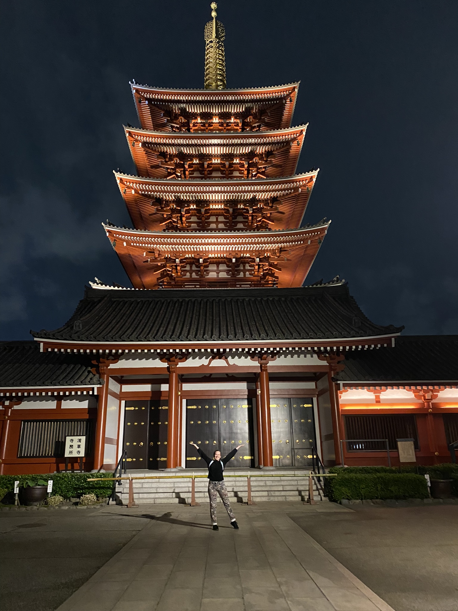
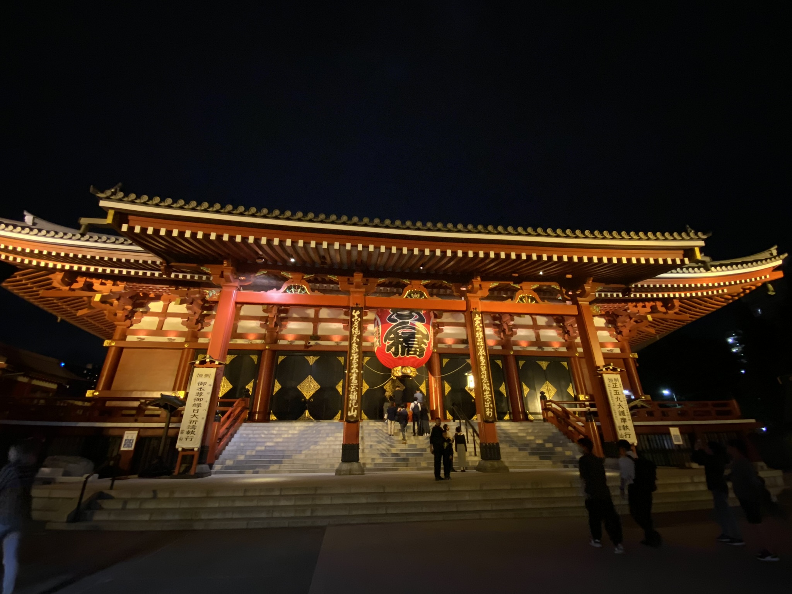

# Noční Asakusa, shabu-shabu a okolí Tokyo Tower

Zatímco denní **Asakusu** kvůli návalu turistů moc ráda nemám, noční Asakusa je něco úplně jiného. Od setmění do přibližně 11 večer je celý **Senso-ji chrám** nádherně nasvícený, obchody zavřené, a sice se tu turisti stále najdou, ale mnohem, mnohem méně. (Zato narazíte více na opilé Japonce :D.)

A nejen tento chrám, ale i nedaleko stojící a z Asakusy krásně viditelná **Tokyo Sky Tree** taky přes noc září všemi barvami. Procházka podél řeky **Sumida**, která protéká hned vedle Asakusy, je taky top. Mosty byly hezky nasvícené. Určitě doporučuji!

Jelikož se blížila půlka semestru, blížily se i midterm projekty a testy. Testy jsem měla naštěstí jen z japonštin a na ostatní předměty "jen" nějaké projekty. Každopádně, sezení ve 25. patře (26F) nejvyšší budovy Ichigaya kampusu s výhledem na Tokio posouvá učení na úplně jinou úroveň.

O víkendu jsme zašli na **shabu-shabu**. Jedná se o japonský hotpot. Na stole před námi byl nízký hrnec s omáčkami, ve kterých si člověk vaří tenké plátky nakrájeného masa a zeleniny. Měli jsme all-you-can-eat a abych řekla pravdu, nejlepší tam byla zmrzlina a japonská ledová tříšt kakigori.

Po tomto vydatném obědě jsme se vydali na procházku k **Tokyo Tower**. Tokyo Tower i její okolí je hezké, každopádně jak jsem si už zvykla na Tokyo Sky Tree, mám ji nějak radši. 

Poblíž byl i velký chrám, **Zojo-ji**, který se ale z části rekonstruoval (pro lepší ochranu při zemětřesení) a osobně mi nijak zvlášť zajímavý nepřišel, ale bylo možné si ho vyfotit s Tokyo Tower v pozadí.

Nejzajímavější byly vedle chrámu stojící malé sošek, které slouží jako bůžči pro ochranu dětí. Jsou zasvěceni zdravému růstu dětí i vnoučat, ale i jako memoriál pro nedonošené či z jiného důvodu nenarozené děti. Mají červené čepičky proti zimě, červenou zástěrku a větrník. A bylo jich tam opravdu hodně.

Další den se konalo pár menších festivalů/akcí, já zašla například na vystoupení **bubny taiko** - i když to byl vysokoškolký klub, byly opravdu dobří a velmi synchronizovaní.

[Zpátky](../)
