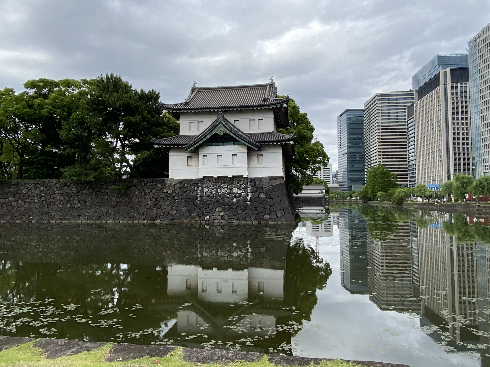
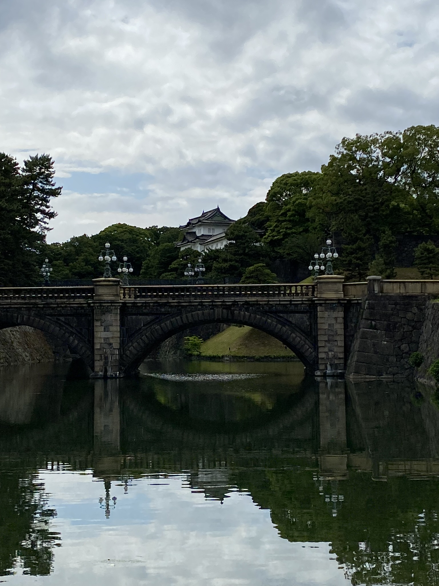
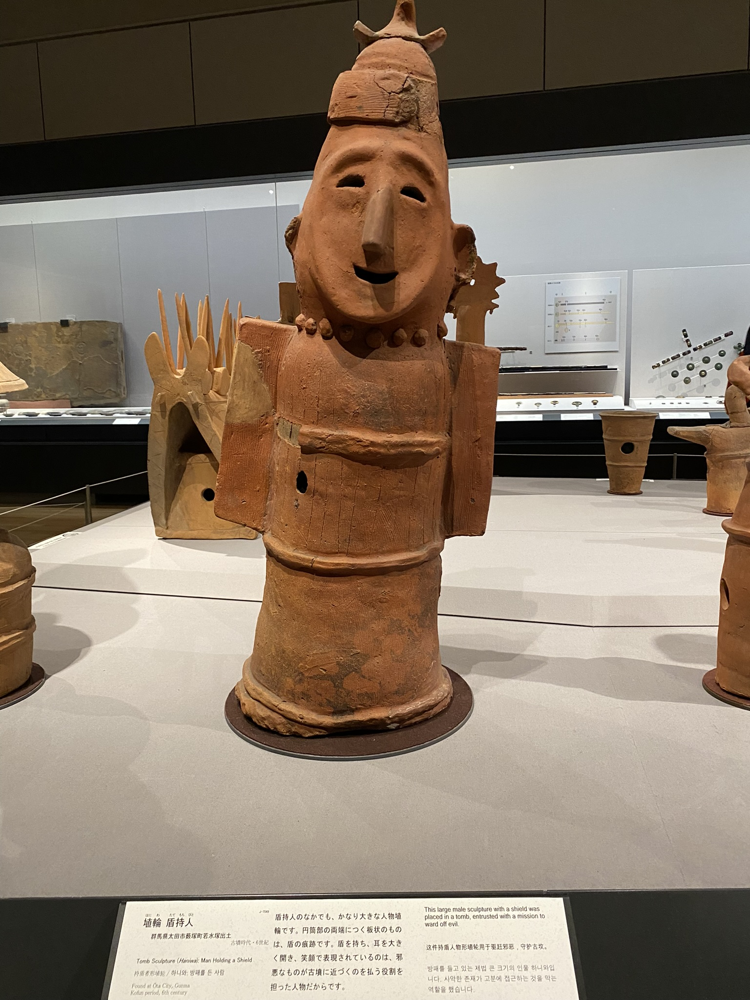
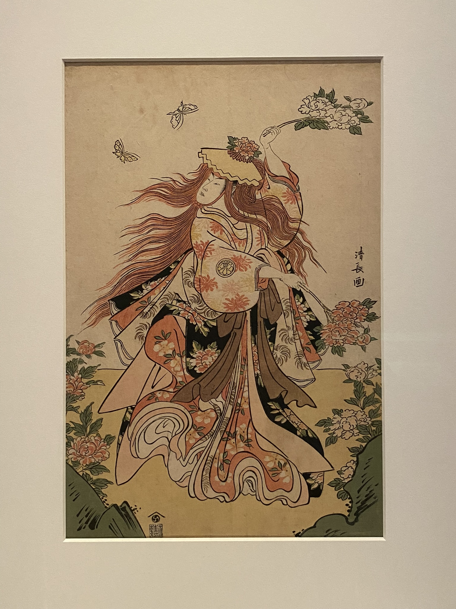

# Císařské zahrady, muzikál Heathers a Tokyo National Museum

Jedna ze svatyň poblíž školy, **Tokyo Daijingu**, měla malou akci sbírání QR kódů v okolí, kdy jste za ně mohli dostat tenhle hezký pin, tak jsem si pro jeden taky zašla.

Poté jsem to prošla do **Kitanomaru National Garden**, **The East Gardens of the Imperial Palace** a **Kokyo Gaien National Garden**, vše parky kolem **Kókjo**, hlavního sídla japonského císaře. Přestože tyto zahrady byly zadarmo, do části s císařským palácem se může jen v rámci komentované prohlídky, která je sice taky zdarma, ale jen dvakrát za den, a všechny časy jsou už beznadějně zarezervovány. Samotné okolní zahrady jsou pěkné, i když z mého pohledu nic extra. Odpočinete si od přeplněného centra, neboť ty zahrady jsou velmi rozlehlé, ale oproti jiným menším je tu toho méně. Každopádně pěkné jsou!

Ve čtvrtek jsem měla možnost vidět jeden známý muzikál, Heathers, v podání vysokoškoláků. Měli to moc povedené, třeba živou kapelu jsem nečekala. Angličtinu měli buď hodně dobrou (asi vyrůstali v zahraničí) nebo se silným přízvukem (asi vyrůstali v Japonsku). Celkově mě ale představení velmi mile překvapilo. 

A pak mi samozřejmě několik dní v hlavě hrála písnička Candy Store (ta melodie je prostě mega chytlavá).

O víkendu jsme v rámci předmětu Visual Arts in Japan zašli do **Tokyo National Museum** v **Ueno parku**, který jsme měli jakožto studenti Hosei Univerzity zadarmo. Museli jsme v rámci mid-term projektu si vybrat pár děl a napsat o nich více. Tak přidávám alespoň pár ukázek.

Jednoho večera jsem náhodně začaly s holkama na koleji téma pasů, a pak je začaly porovnávat a hledat si o nich více. Například existují 4 barvy pasů, a barva trochu souvisí s historií. Každé pasy mají různě více či méně detailní stránky na víza. Nejhezčí pas má stopro Austrálie!

[Zpátky](../)
