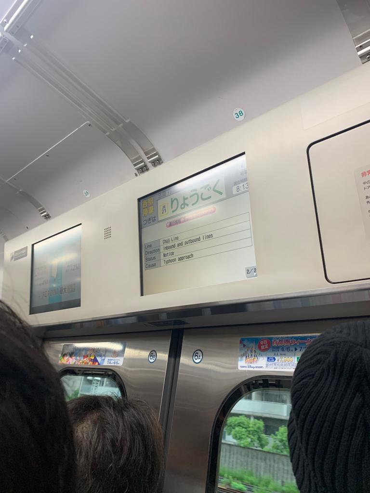
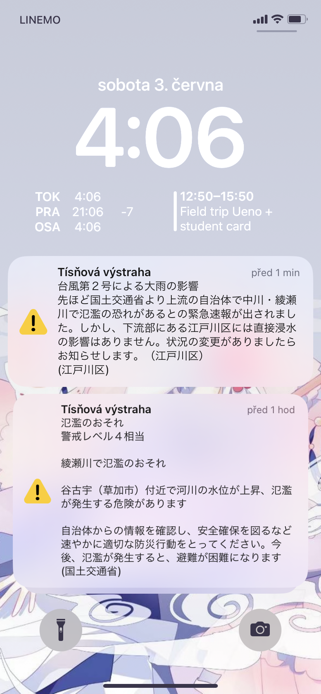
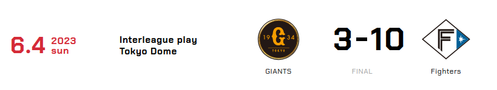

# Tajfún, profesionální baseball a čtvrť sekáčů

Dne 2. června 2023 se k Japonsku přiblížil tajfún. Šel sice podél Japonska, jeho vliv byl ale dost poznat - velmi silný vítr a velmi silný désť. 

Vlaky samozřejmě nabíraly zpoždění, na druhou stranu, být tohle Česko, tak ty vlaky ani nevyjedou.

No a co by to bylo za tajfún bez budíčku ve formě tísňových SMS zpráv (které mimochodem chodí jen na iPhony?). A nejlépe ve 3 a ve 4 ráno. A nejlépe ještě takové, které se vás ani netýkají. Respektive, to první ve 3 ráno varovalo před záplavy, které sice byly, ale jinde, než kde bydlíme. No a to druhé ve 4 ráno byla jen zpráva o tom, že v Edogawa-ku, kde bydlíme, žádné větší nebezpečí nehrozí. Ale prostě jsme to asi museli vědět ve 4 ráno. A navíc to poslali jen v japonštině. Well, začínám si na ten zvuk "budíku" nějak zvykat. :D

V neděli 4.6.2023 jsem měla šanci jít na baseballový zápas - domácí Tokijští GIANTS proti FIGHTERS z Hokkaida. Zápas se konal v **Tokyo Dome** na zastávce **Suidobashi**, takže jsem byla velmi nadšená, že můžu stadión vidět zevnitř. A impozantní rozhodně byl! Jen teda domácí GIANTS, jejichž fanoušci byli ve velké přesile, prohráli s velkým rozdílem...

Mimochodem dva hráči nás zaujali - první byl hráč z Hosei Univerzity a druhý byl hráč, který byl očividně ve hře poprvé za sezónu, a díky odpalu měl chvíli statistiky na 100% (perfektní).

Detaily zápasu jsou zde, i když jen v japonštině: [Odkaz.](https://www.giants.jp/game/20230604_8003_1/)

Také už jsem stihla vyrazit jedno odpoledne do čtvrti **Shimokitazawa**. Ta je známá svým velkým množstvím sekáčů. Některé mi přišly i tak moc drahé, ale našlo se pár obchodů, které měly velmi hezké kousky, a to už od nějakých 80 Kč (500 yen) za kus. Vypadá to, že část věcí, co nově povezu zpátky, bude nové oblečení...

[Zpátky](../)

