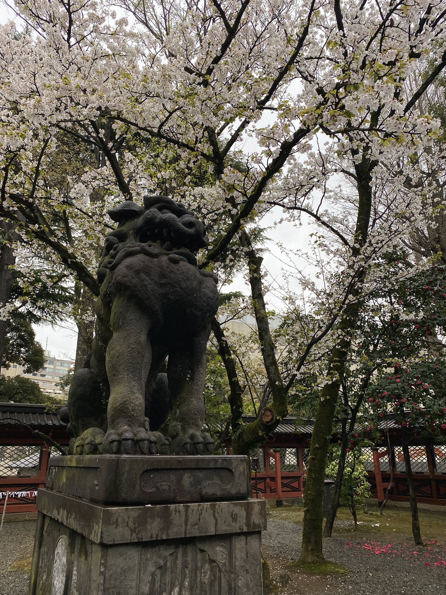
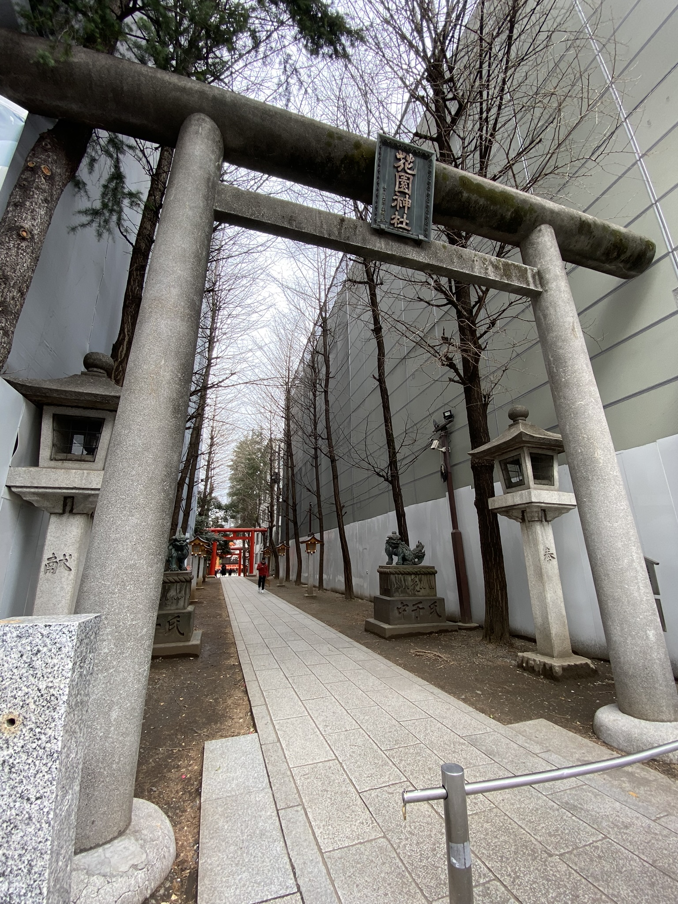
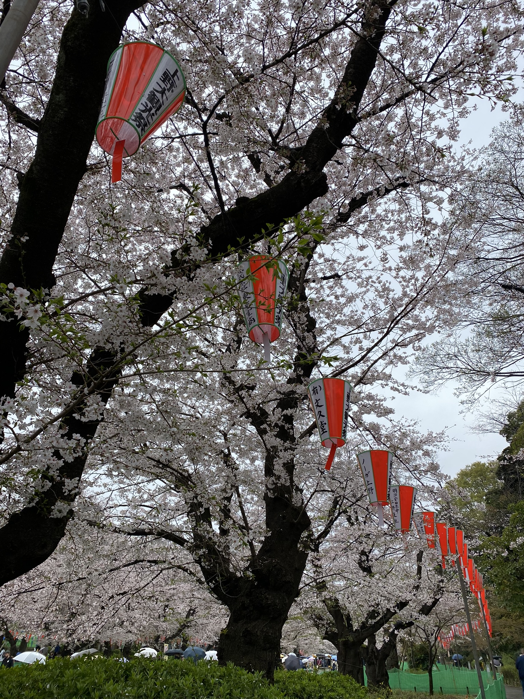
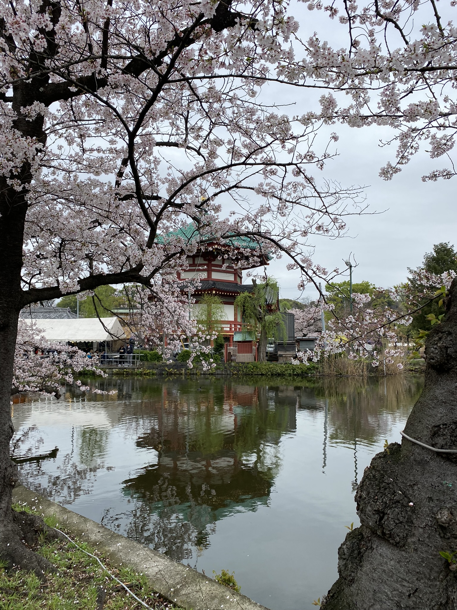
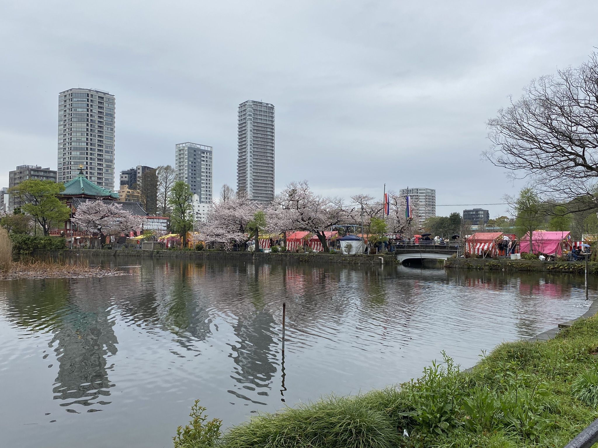

# Svatyně kam se podíváš, park bezdomovců a sakurový déšť

Google mapy ukazují 2 minuty chůze od Hakusan svatyně. Tak to musí být už někde tady. Hele, tu jsou nějaké schody... a nějaká svatyně a vedle hřbitov. Ale vypadá nějak jinak, že obrázky na Googlu. Ano, dneska se mi povedlo najít jinou svatyni při hledání té plánované. A to je v Japonsku celkem běžné a zároveň jedna z věcí, kterou tu mám tak ráda. Člověk si jde a najednou brána a posvátné místo. A je jedno, jestli je člověk na venkově nebo v Tokiu, svatyně a chrámy mají své místo všude.

Vypisovat všechny svatyně a chrámy, které jsem navštívala za jednu celodenní procházku, ať už plánovaně nebo náhodně, nemá smysl - bylo jich prostě mnoho a každá měla své kouzlo.

Zmíním tu ale jednu, která byla obzvlášť hezká a nehemžila se turisty (byli tam, to ano, ale kam se hrabou jiné) - **Nezu svatyně**.

A jak jsem říkala, že je objevuju náhodně? Přesně takhle: člověk jde a najednou prostě jednu vidí. Třeba tuhle uprostřed nově stavěných budov!

V Japonsku jsou obecně šintoinstické svatyně a budhistické chrámy. Rozdíly jsou tam velké - od toho, kdo se uctívá (bůžci přírody vs. Buddha), jakou bránu má (brána Torii se sochy "psů" Komainu vs. brána Sanmon), či jakým způsobem se tam člověk modlí. Šintoinstické svatyně byly v Japonsku první, poté přišel Buddhismus, ovšem protože to kde kdo zaměňoval a nic nebylo pevně dané, mnoho svatyň/chrámů má prvky z obou. Pro fajšmekry doporučuji toto pěkné videjko: https://www.youtube.com/watch?v=Ll696KfKjEc

Poté jsem pokračovala **Ueno** parkem dál. Překvapilo mě, hlavně na okraji, množství bezdomovců - pro Japonsko celkem pro mě nová podívaná. Když se ale člověk dostal dál, spatřil krásu rozkvetlých sakur. Prý se dokonce (a nejen zde) sakury v noci podsvěcují. Někdy asi budu muset na noční podívanou vyrazit, musí to být nádherné. 

No a nakonec pár fotek!

[Zpátky](../)
