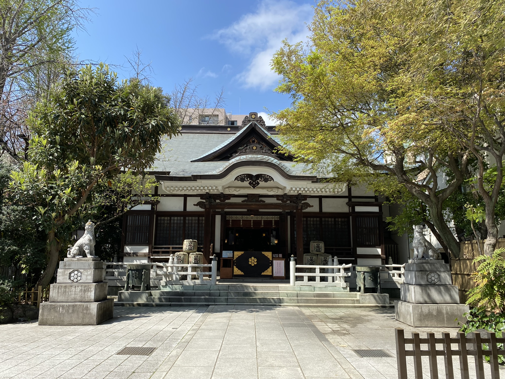
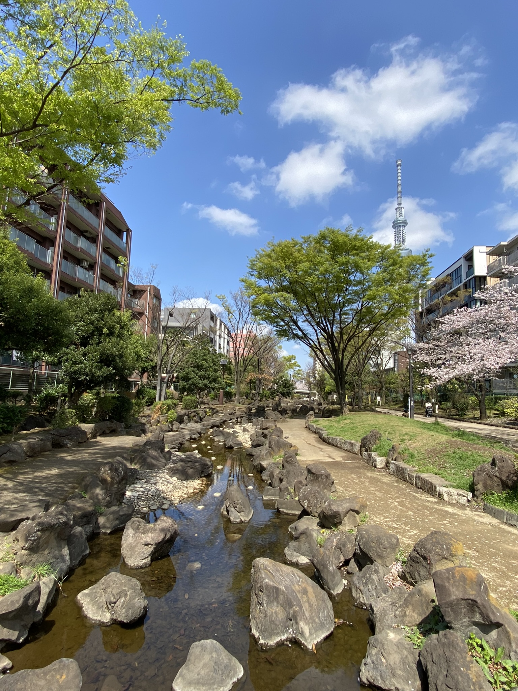
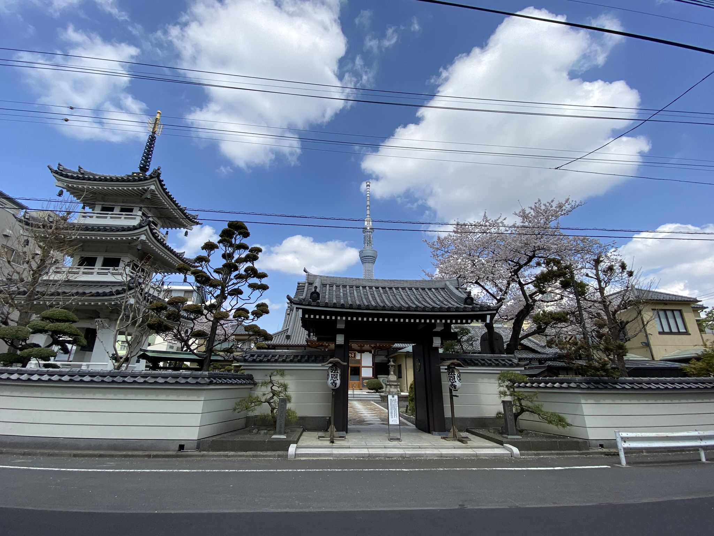
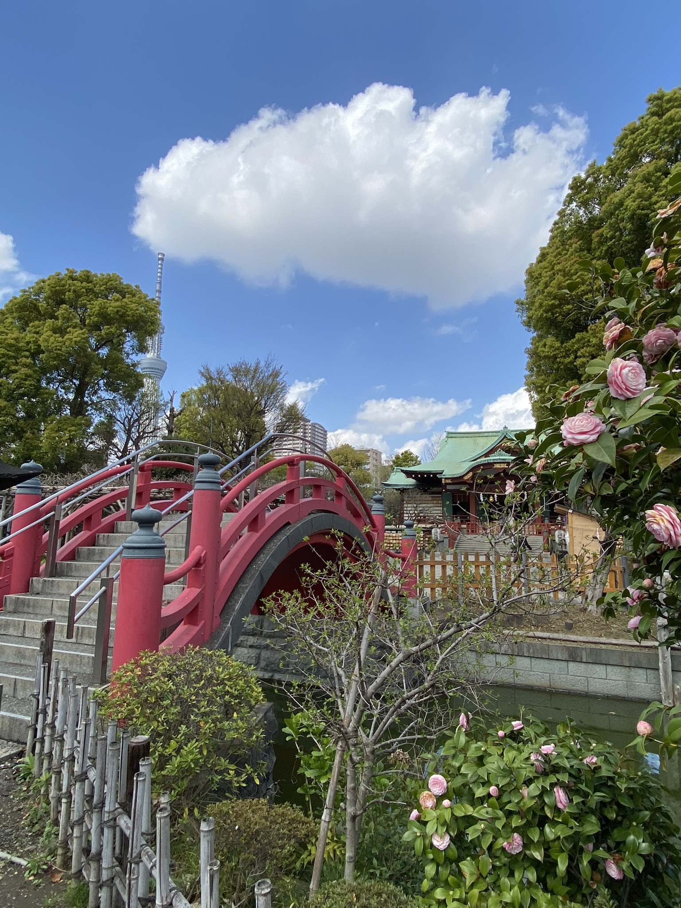
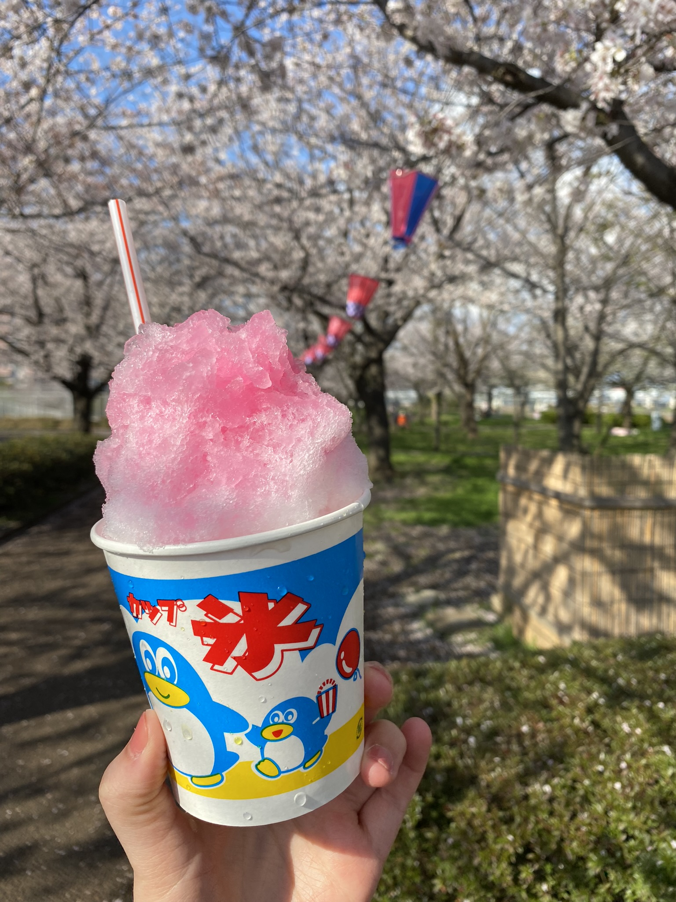
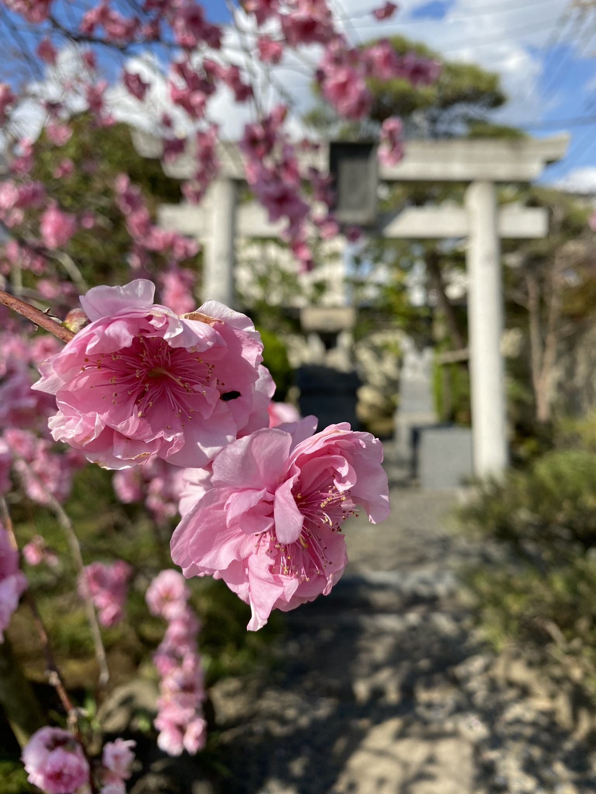
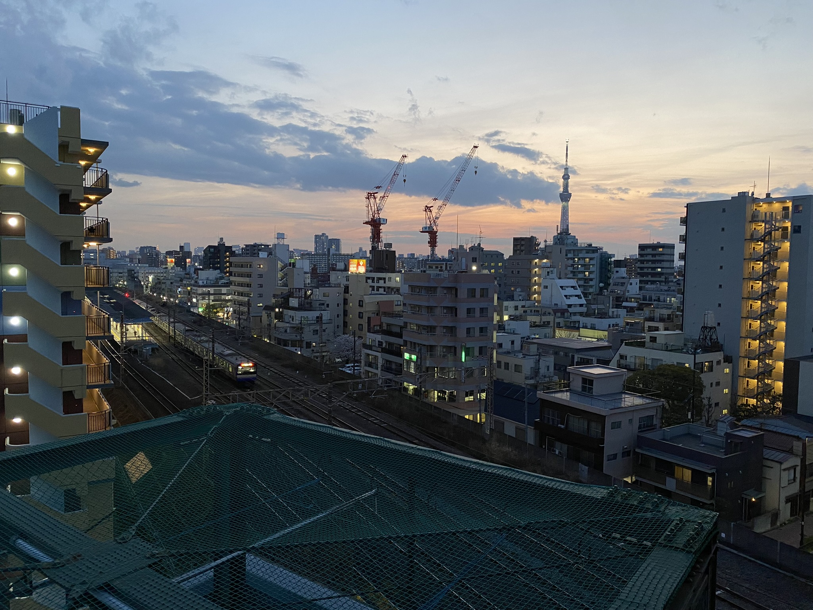

# Na kole po chodníku, 10 svatyň Tokia a koleje se střechou

Jelikož jsem od kamaráda koupila kolo, jela jsem na něm na koleje ho tam nechat, neboť kola samotná zde nemůžou do metra/vlaků/apod. 

Japonci jsou obecně milovníci kol. Trochu otázkou je, jak moc dobrovolně, když si člověk vezme vysoké ceny hromadné dopravy, na druhou stranu na kola jsou prostě zvyklá. A to tak, že kolo tu má skoro každý, nikdo až na malé děti a lidé "pracující jízdou na kole" (policie, donášky) tu ani nenosí helmu, jezdit po chodníku je naprosto v pořádku a na samotná kola se dělají i registrace na vaše jméno. 

Vydala jsem se tedy poklidnou jízdou, která mi nakonec zabrala asi 3x déle než plánovaně. Prostě jsem neodolala a cestou navštívila asi 3 různé svatyně a jeden nádherně kvetoucí park, vše objeveno zcela náhodně. Navíc na většině těchto míst jsem byla buď sama a nebo jen s pár místními. Kam se hrabou turistická místa!

Neodolám a dávám sem pár fotek z 11km dlouhé cesty:

V jedné z těchto svatyň, **Kameido-Tenjin**, jsem si všimla, že tato svatyně je součástí **10 svatyň Tokia**, kam patří i **Hakusan** a **Nezu** svatyně, které jsem již navštívila předchozí dny - cíl mám tedy jasný, postupně je navšívit všechny!

Když nastal den stěhování na kolej, zabalila jsem kufry a z Airbnb ubytka vyrazila na cestu. Vše dopadlo ok a paní u dveří mě hned vítala. Nastalo seznámení s tím, jak to tady chodí... no, až na to, že full in japanese. Ta paní byla hrozně hodná a tak, ale bylo vidět, že s angličtinou bojuje mnohem víc než já s japonštinou. Člověk ale naštěstí pochopí hodně jen očima a ukazováním.

Odpoledne jsem ještě vyrazila na kole poznat krásy okolí, navšívila další 3 šintoinstické svatyně (come on, mám na ně slabost! :D) a krásný kvetoucí park, kde jsem si rovnou dala Kakigouri - ledová tříšť pokapaná sladkým sirupem. Jí se jako zmrzka v kelímku a vyhovuje mi mnohem víc než ta naše ve stylu pití - japonská varianta není přeslazená.

A na závěr - na koleji máme přístup až na střechu! A je z ní vidět i Tokyo Sky Tree, nejvyšší budova (věž) v Japonsku a momentálně 5. nejvyšší stavba na světě.

[Zpátky](../)
