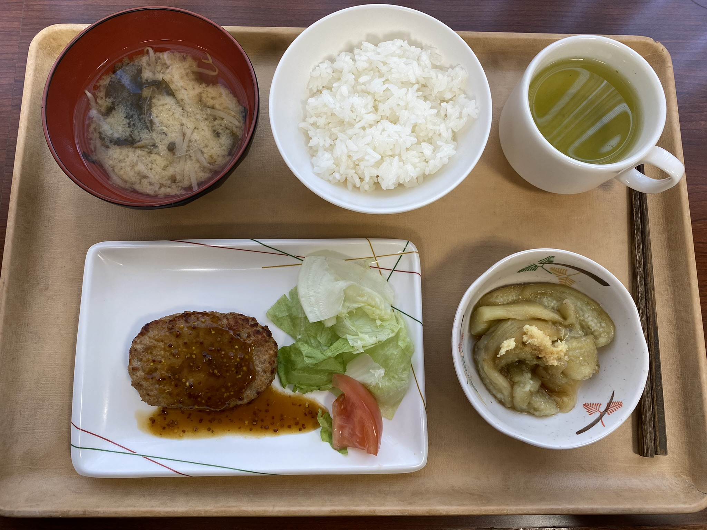

# Rýže k snídani, večerní koupel a školní kluby

Tak začala škola (7.4. - zaprvé na české školy dost pozdě a za druhé proč to dají první den v pátek?) po dvou dnech Orientace a systém se tu tolik nelyší. Chodíme na věci co nás zajímají a za dva týdny vyplníme formulář s předměty, které chceme, a tím si je zapíšeme. Pokud se teda na předměty dostaneme, neboť některé provádí tzv. selection proces, pokud je o předmět zájem nad kapacitu. 

Hlavní kampus tu je na zastávce **Iidabashi**. Je to u řeky, ze školy je pěkný výhled a je to blízko jiným oblíbeným místům. Bez přestupu se z **Iidabashi** dostaneme zpátky na kolej **Hirai** nebo druhým směrem na **Shinjuku**. 

Koleje samotné jsou fajn. Většinu zahraničních studentek daly na stejné patro, takže se často vídáme (a slyšíme, přeci jenom, je to kolej, takže z chodby je vše slyšet) a hodně rychle jsme se seznámily. Kromě chodby se ještě potkáváme všechní dny a soboty i u snídaně a večeře, které máme v rámci nájmu.

Trochu k tomu jídlu - večeře jsou vždy stejné, u snídaně si člověk může půlku jídla vybrat, zda si k "hlavnímu jídlu" dá rýži s polévkou či toast s marmeládou/máslem. Toast a obecně pečivo je v japonsku vždy měkké (a často sladké), něco jako namazaný chleba šunkou jsem tu ještě neviděla. Každopádně rýži si k snídani dávám často a zvyknout si na ni rozhodně jde. 

A teď kvízová otázka! Co z těchto dvou fotek je snídaně a co večeře?

Další věcí, která je v Japonsku zakořeněná, jsou lázně (onsen). A to tak, že kromě sprch máme jednu velkou vanu jako lázeň k dispozici hned vedle sprch.

A poslední věc, rychle ještě zpátky ke škole. V Japonsku letí školní kluby, většina studentů v nějakém školním klubu je. První dny tu probíhalo představování všech těchto kluků (je jich opravdu hodně a každý může mít i desítky členů) se snahou nabrat nové členy. Bohužel pořád jsou to Japonci, i když vysokoškoláci, takže bez dobré znalosti japonštiny je hodně těžké se něco dostat, pokud klub sám anglicky mluvící studenty nevítá.

Zde ukázka jednoho z klubů:

[Zpátky](../)
