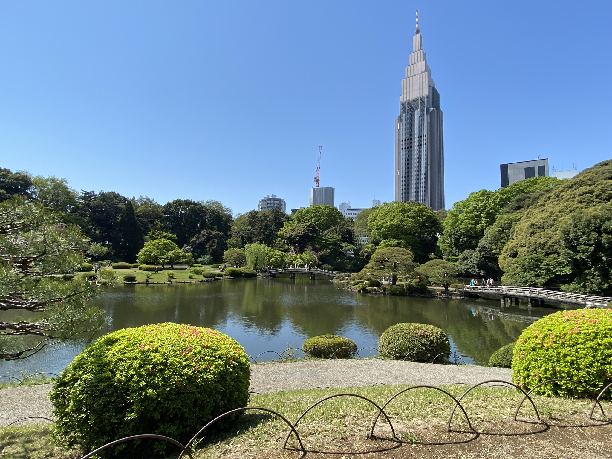
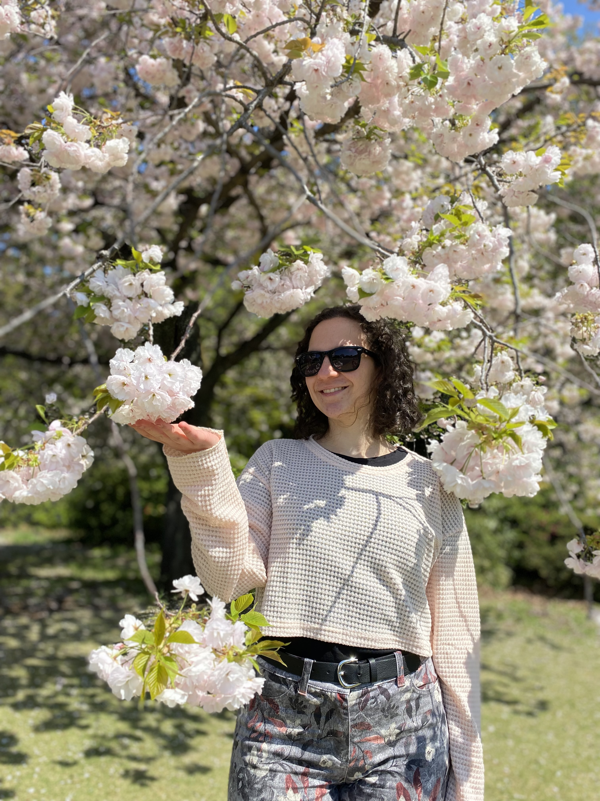
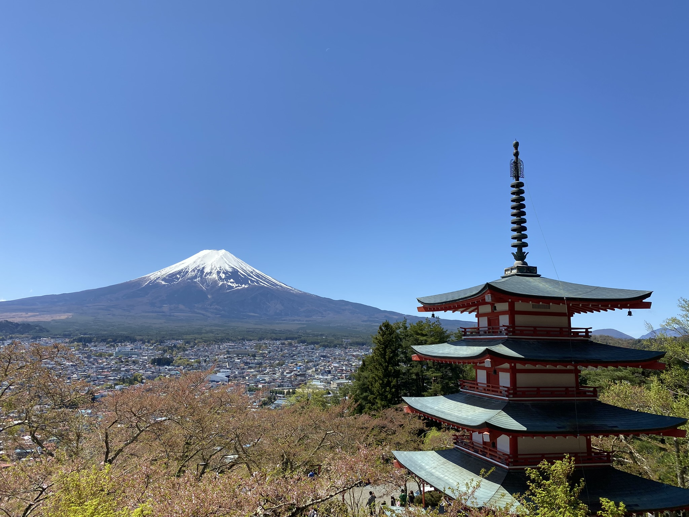
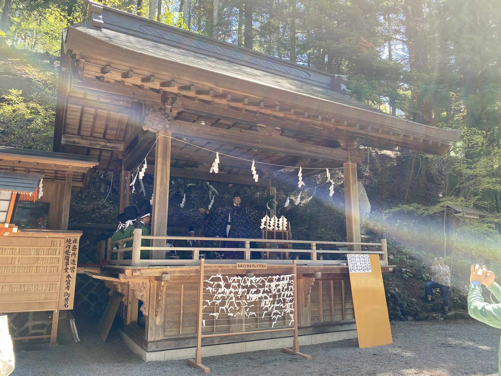
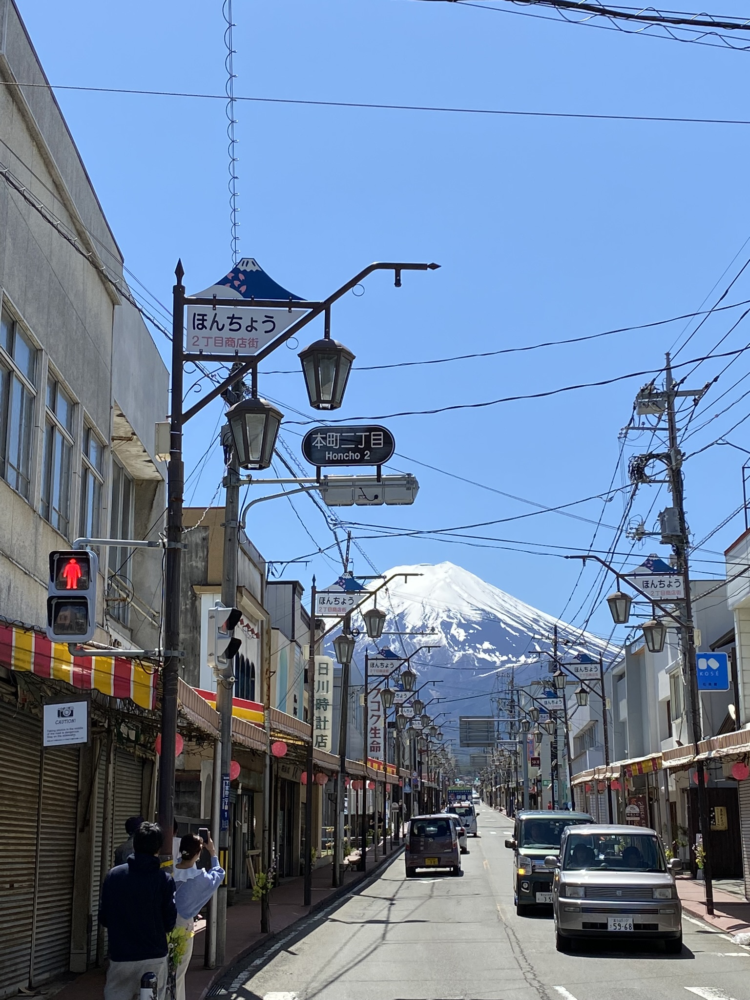
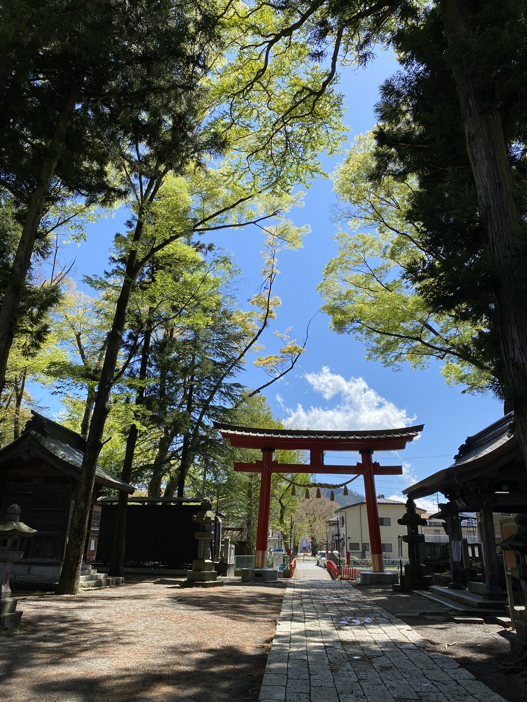
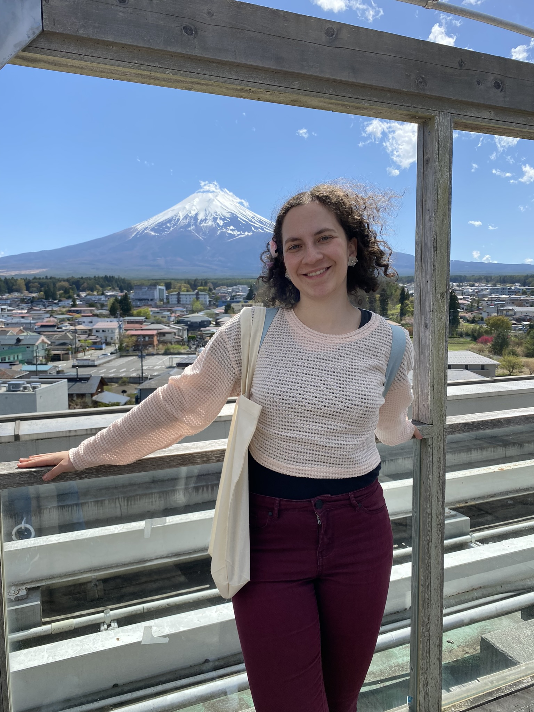

# Výlet na dvakrát, poslední sakury a výhled na horu Fuji

Budík na 6, v půl vyrážet vlakem na Shinjuku, koupit lístek na bus a vyrazit na **Chureito Pagoda** do **Shimoyoshida**. Well, plán zní jednoduše, realita zní "Všechny autobusy jsou do 12:45 zcela obsazené". Tak jsme rovnou koupily lístky na další týden a pak přemýšlely, co takhle brzo v **Shinjuku**, navíc v neděli, vůbec dělat.

Přestože je Tokio stále žijící velkoměsto a vlaky kolem osmé-deváté jsou totálně narvané (člověk se cítí jak sardinka), obchody (kromě konbini co jedou nonstop) tu otevírají až kolem desáté či jedenácté. 

Nakonec jsme se rozhodly pro **Shinjuku Gyoen National** pro lov posledních sakur v Tokiu.

Fotka naší výletové skupinky z pokusu č. 1: Amelie, Elizabeth, Aisha, já, Tomomi:

Uplynul týden, nastala neděle a náš pokus číslo 2. Celý týden jsme bedlivě sledovaly počasí, neboť být blízko hory Fuji neznamená automaticky její dobrou viditelnost. Ovšem nakonec se vydařilo, a to nejlépe jak jen mohlo - 100% viditelnost, nebe bez mráčků a teplo tak akorát! Poslední sakury sice mezitím už úplně odkvetly, ale i tak to byla moc hezká podívaná.

**Chureito Pagoda**:

Ve svatyni hned pod Pagodou **Shiogama Shrine** byla slyšet hudba. Koupila jsem si tam _omikuji_, papírek s předpovědí budoucnosti, zda člověk bude mít štěstí nebo smůlu. Když je předpověď špatná, papírek se přiváže ve svatyni, aby se předpověď nenaplnila. Já po dlouhé době měla "střední štěstí", což je jen jeden krok od nejlepšího "velkého štěstí", takže jsem po dlouhé době papírek vázat nemusela.

**Shimoyoshida** je velmi pěkné místo, především je úžasné vidět Fuji skoro na každém kroku. Ne nadarmo byly všude cedule, ať nevcházíme horu fotit do prostřed silnice.

Moc hezká byla i svatyně **Omuro Sengen** s motivy koní. Hned vedle pak stála skutečná stáj s koňmi.

Jedna zdarma vyhlídka byla i na střeše obchoďáku.

A na závěr fotka naší výletové skupinky z pokusu č. 2: Elizabeth, já, Tomomi, Amelie, Aisha:

[Zpátky](../)
