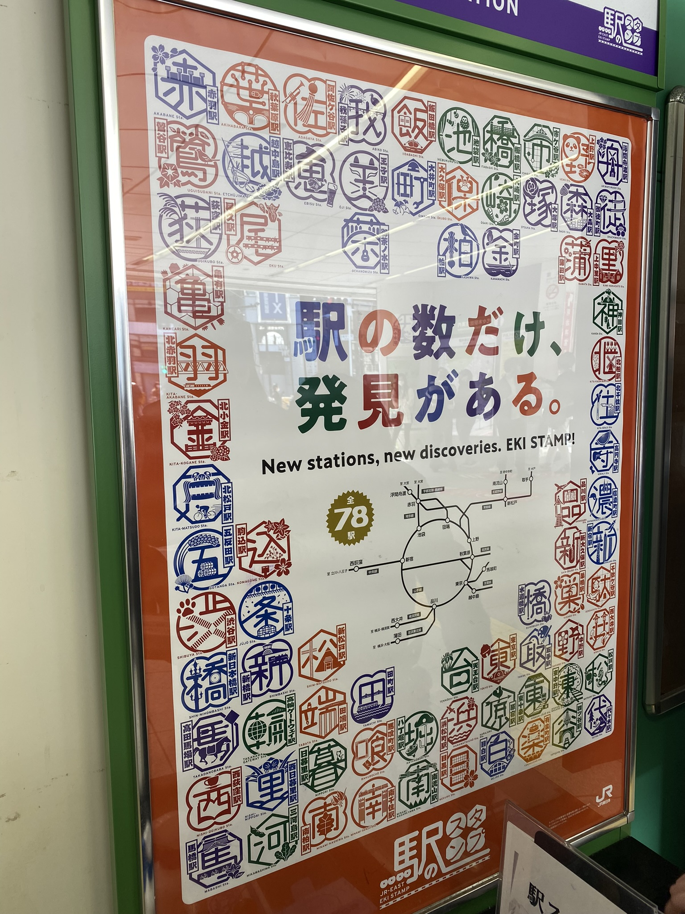
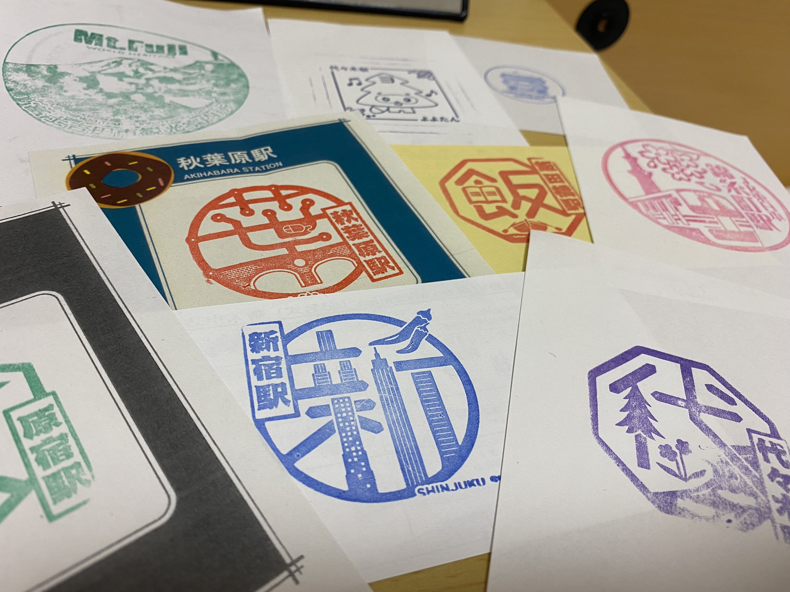
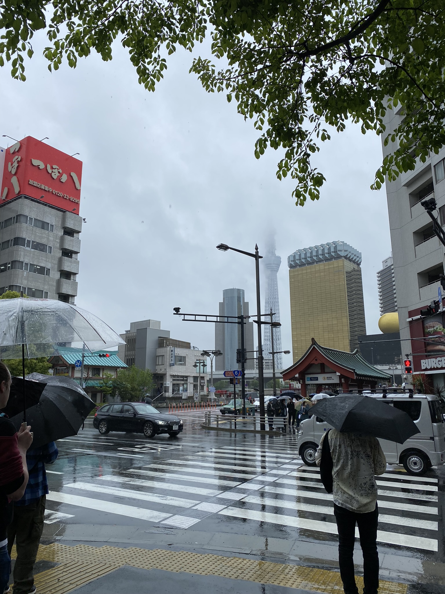

# Razítka všude možně, Sky Tree v oblacích

Kdo má rád razítka všeho druhu, ten se v Japonsku (Tokiu) má. Všemožná razítka se dají najít na stanicích vlaků, u památek v kulturních centrech či za poplatek i v svatyních (a že jsou nádherná!).

Osobně jsem si žádný spešl deníček na razítka nekoupila a razítka tisknu na náhodné papíry co najdu, i tak jsem jen za pár dní mnoho razítek nastřádala.

Počasí je tu dosti proměnlivé. Pár dní zpátky například úplně propršelo. Přijde mi v těchto dnech zajímavý pohled na Tokyo Sky Tree, především když vzhledem k její výšce není ani celá vidět.

[Zpátky](../)
