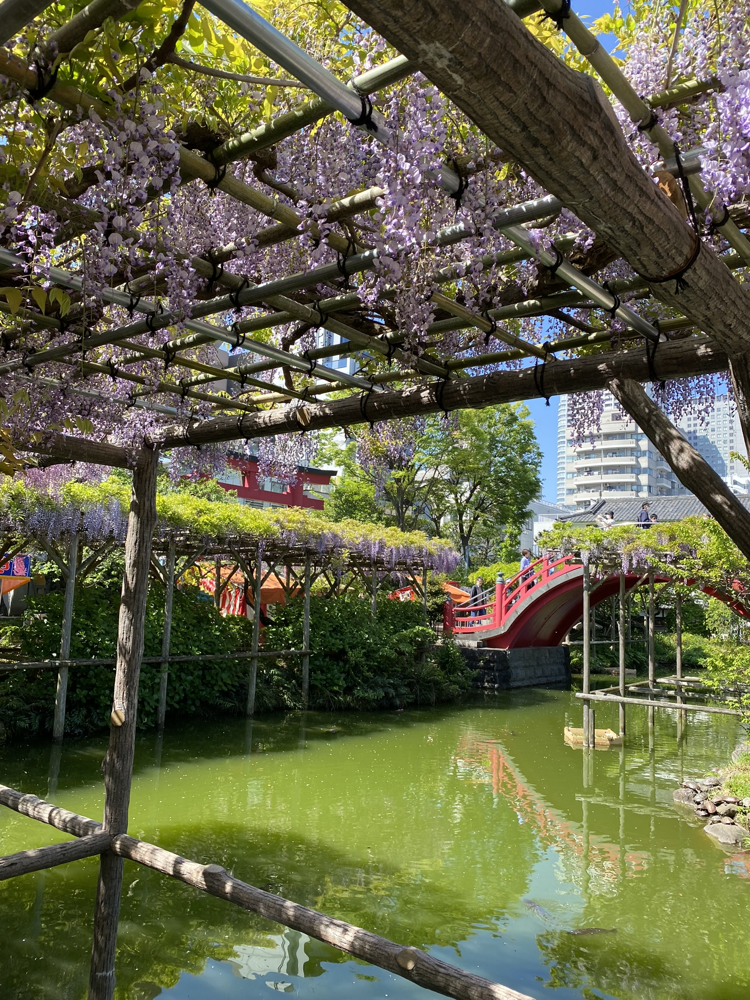
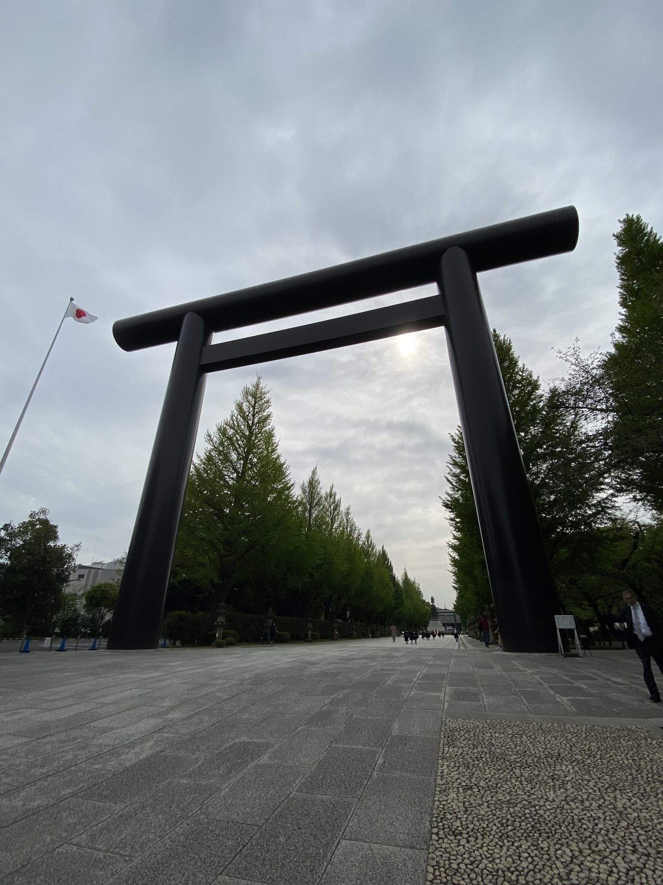
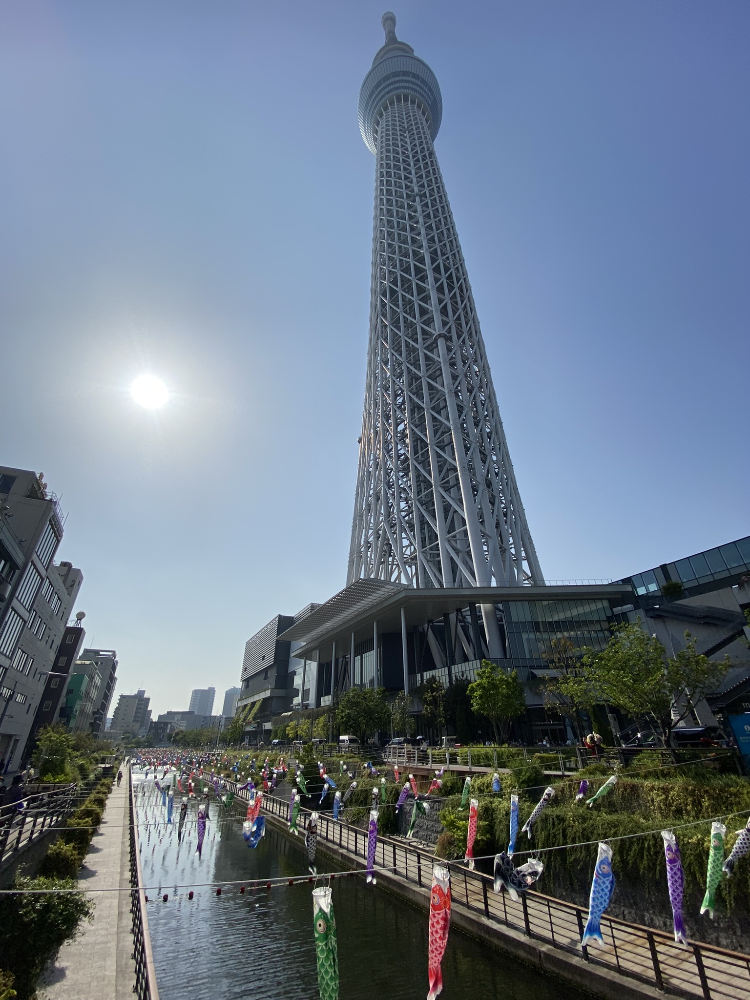
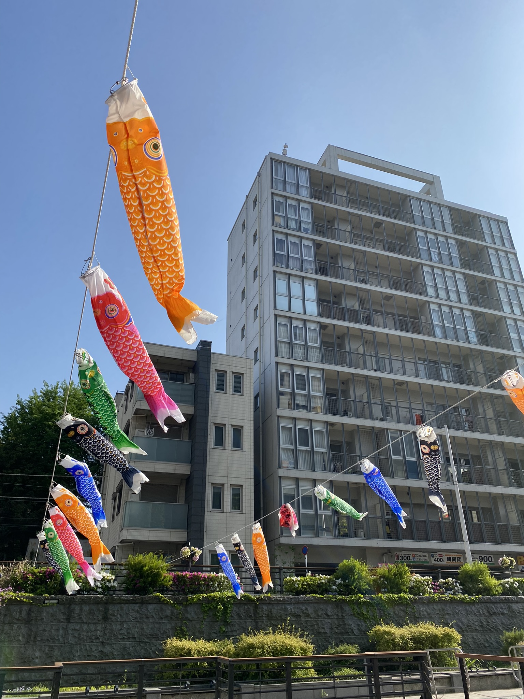

# Kvetoucí vistárie, kontroverzní svatyně válečných zločinců a kapří přípravy na Den dětí

Zatímco sakury odkvetly a člověk by čekal, že zájem o kvetoucí stromy a rostliny opadne, opak je pravdou. Sakury tu člověk už sice nepotká, ale kvetoucí vistárie ano. Proto jsme jednoho rána zamířily do **Kameido svatyně** na festival kvetoucíh vistárií. 

Ta Tokyo Sky Tree v pozadí je vždy pěkný bonus!

Také jsem konečně prošla trochu okolí hlavního kampusu. Hned nad školou je jedna z velkých a známějších svatyn, jenže když člověk trochu zabrousí do její historie, zjistí celkem nemilé věci. **Yasukuni svatyně** je sice zasvěcena válečným obětem, jenže mezi těmi přibližně 2.5 miliony zmíněných obětí je i 14 válečných zločinců. Není proto divu, že tato svatyně je Čínou i Koreí vnímána jako symbol japonské válečné agrese a návštěvy politiků jsou brány velmi negativně. Jeden článek o politikovi co ji navštívil minulý rok je zde: [Odkaz](https://www.aljazeera.com/news/2022/8/13/japanese-minister-visits-yasukuni-shrine-for-war-dead-report).

Obecně nerada fotím místa se špatnou historií a to místo na mě nepůsobilo moc přívětivě - u vchodu policejní stráž, ve svatyni seriózně vypadající lidi v oblecích a nejdražší amulety co jsem zatím kde ve všech svatyních viděla (všechny za 1000 yenů, přičemž normálně se ceny pohybují kolem 500-700).

Každopádně prostor před svatyní byl velmi impozantní a brány ohromné, tak sem dávám alespoň jednu fotku:

Také se pomalu blíží japonský Den dětí, který je zde 5.5. Pro tento den jsou typické _koi nobori_, barevní ve vzduchu vlající kapříci. Hezký pohled na ně byl například u Tokyo Sky Tree.

[Zpátky](../)
