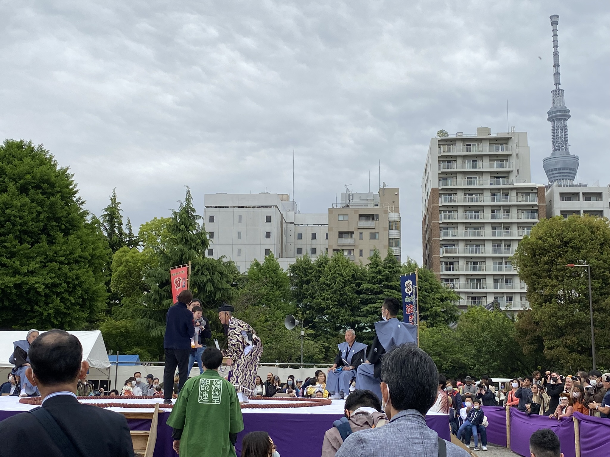
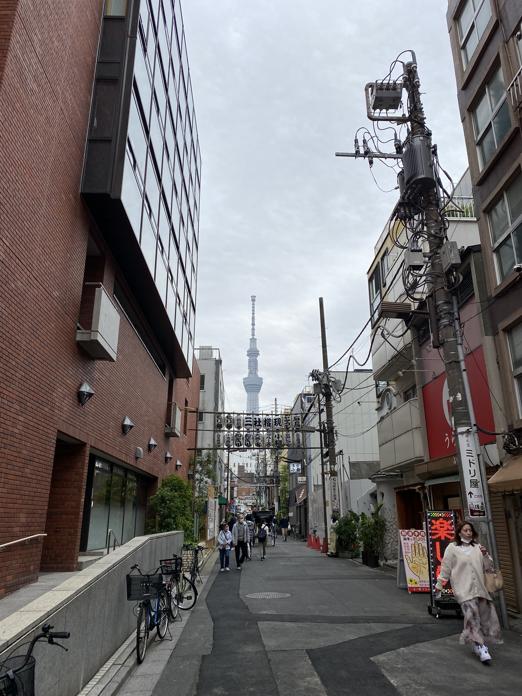
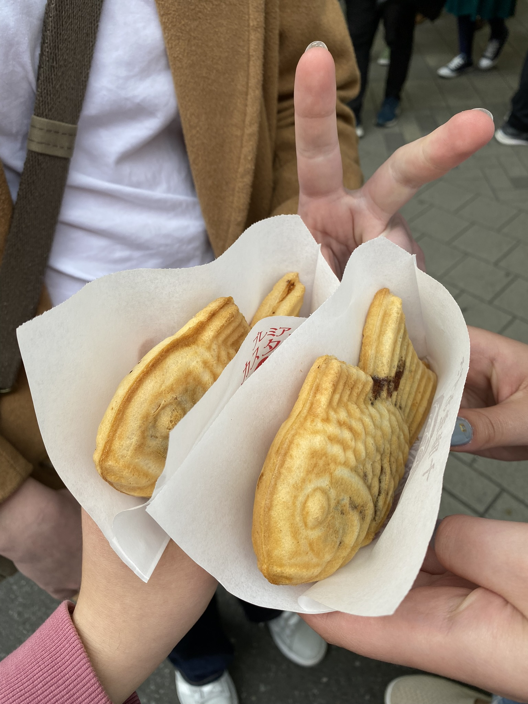
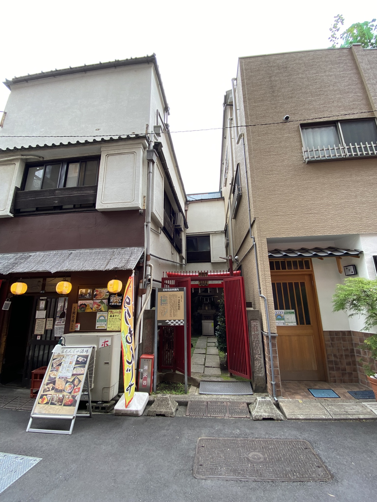
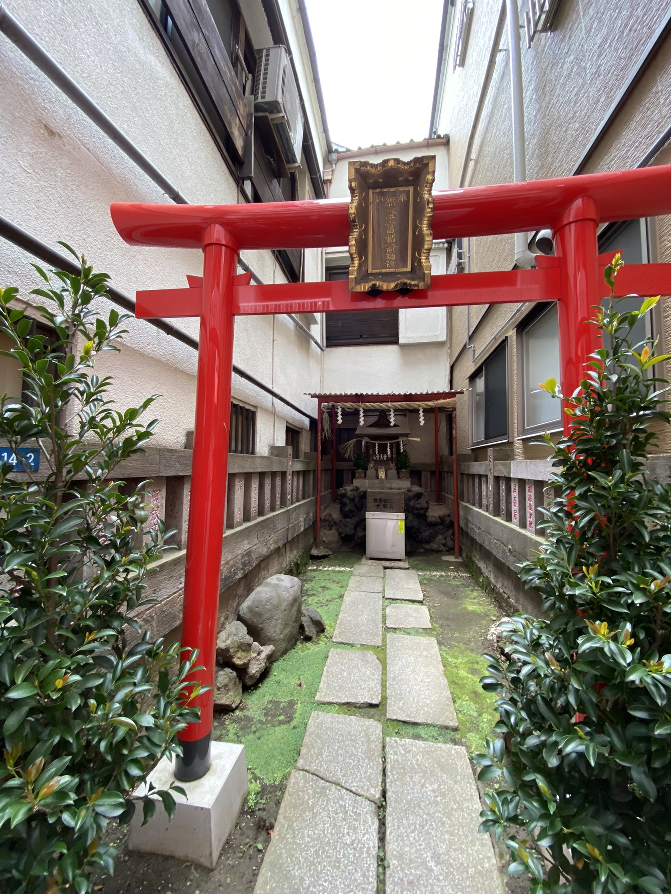
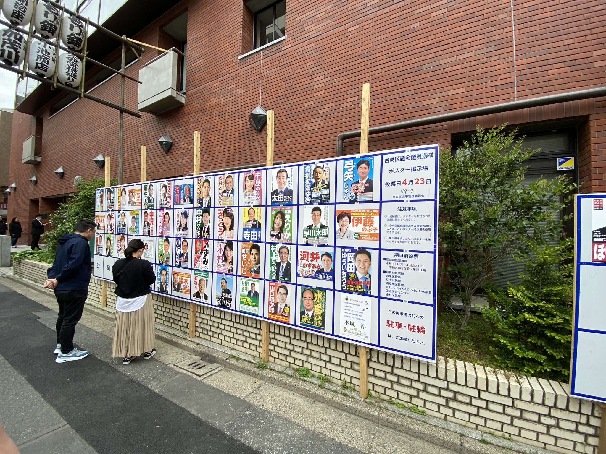
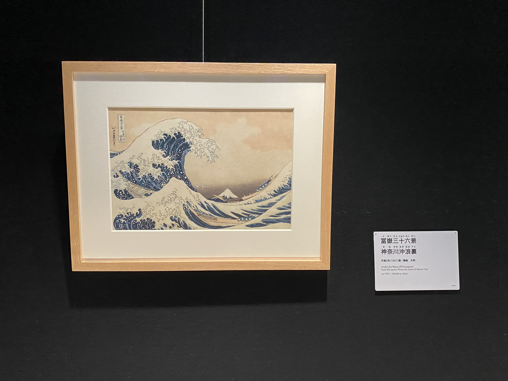
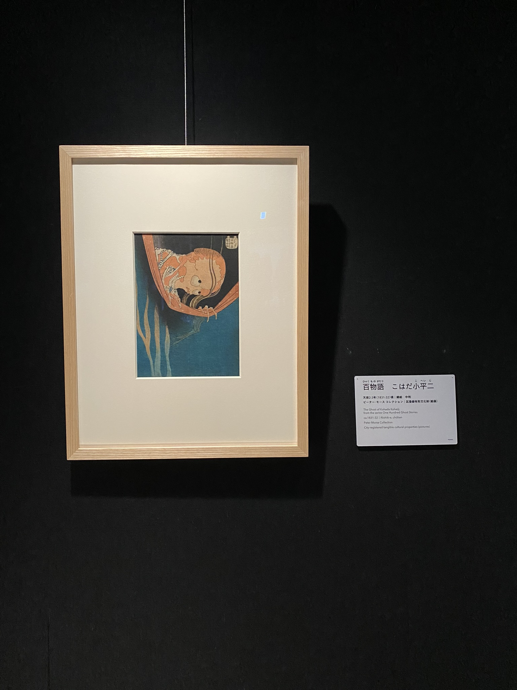

# Sumo zápasníci bez sumo zápasníků, předvolební kampaň a The Great Wave of Katanazawa

V sobotu 22.4. jsme se vydali na událost _Sumo make baby cry_, tedy _sumo zápasníci snažící se rozbrečet děti_. Akce to byla zajímavá, jen ti sumo zápasníci nějak úplně chyběli... Moderátor mluvil pouze japonsky, ale mám pocit, že mluvil o tom, že kvůli covidu a pandemii (kdy akce nebyla), je to letos bez sumo a místo nich si své děti drželi sami rodiče. Ti vždy s dítětem vkročili do sumo ringu a cílem bylo své dítě rozbrečet více. Zde se totiž hlasité brečení bere jako ukázka síly a zdraví. Ale co jsem tak brouzdala po internetu, tradice se může na různých místech Japonska lišit. 

Celá tato brečící akce se děla vedle **Sensō-ji** budhistického chrámu ve čtvrti **Asakusa**, jednoho z nejnavštěvovanějších v Tokiu. Nezávisle na dni, času či počasí, lidí tu je vždy hromada, a to jak cizinců, tak místních.

Co se mi ale na **Asakusa** líbí jsou ty uličky kolem, hlavně ty, ze kterých vykukuje Tokyo Sky Tree. 

V jedné jsme si dali i _taiyaki_, sladké těsto ve tvaru rybičky plněné něčím sladkým, často sladkými fazolemi anko nebo custard krémem. Taiyaki je asi jedno z mých nejoblíbenějších sladkých věcí v Japonsku, občas si jej kupuju i v sámošce, i když je studené.

Při hledání ztracené kamarádky bez dat v mobilu jsem narazila i na tuhle super čuper schovanou svatyňku uprostřed domů a o fotky se musím podělit:

Také se už konečně blíží konec předvolební kampaně. Ta tu probíhá celkem odlišným způsobem než v Česku: Politici tu na střechu auta přimontují cedule, megafony, nasednou do auta a projíždí čtvrtí/městem. A to i klidně v 8 ráno. A když už zrovna nebudí lidi, co si chtěli o víkendu přispat, stojí poblíž nádraží a rozdávají kapesníčky (další způsob jakým se zde dělá reklama: rozdáváním kapesníčků s přilepeným letáčkem). Kromě toho tu člověk po městě naráží na velké cedule s datem voleb, kde si každý kandidát přilepí svůj plakát.

Velmi povedená humorná videa o předvolebních kampaních jsou tato od Dogena: [Video 1](https://www.youtube.com/watch?v=AOJAxf9XpoQ), [Video 2](https://www.youtube.com/watch?v=lMA4X2Tpf5s).

Také jsem zašla trochu za kulturou. Poblíž **Ryougoku** stanice je **The Sumida Hokusai Museum**, kde je výstava umělce Hokusai. Přestože jméno asi nic moc nikomu neřekne, věřím, že tento obraz už ano:

Velká vlna u pobřeží Kanagawy/The Great Wave off Kanagawa je dřevotisk žánru ukiyo-e. Ukiyo-e jsou "obrazy probíhajícího, pomíjivého života", jak říká Wikipedie, a víceméně to jsou obrazy přírody, života, divadla, sumo, žen, a všeho možného v období kdy toto umění prosperovalo, a to 17.-19. století. 
Jelikož je to také často dřevotisk, tedy výsledný obraz je pak jen kopií, mám trochu zmatek v tom, co teda jaká kopie je a jestli obraz, co jsem viděla na výstaně, se vůbec dá považovat za nějaký "originál". Tento styl umění se mi velmi líbí, o čemž svědčí i to, že jsem si v muzeu koupila o ukiyo-e knihu, tak snad už příště budu víc vědět o čem že to přesně píšu.

Také mám velmi ráda tento obraz:

V Praze mám knížku o Youkai, strašidlech a duchách v ukiyo-e obrazech a tento obraz je na obalu knihy. Bylo proto milé obraz vidět i na výstavě.

[Zpátky](../)
