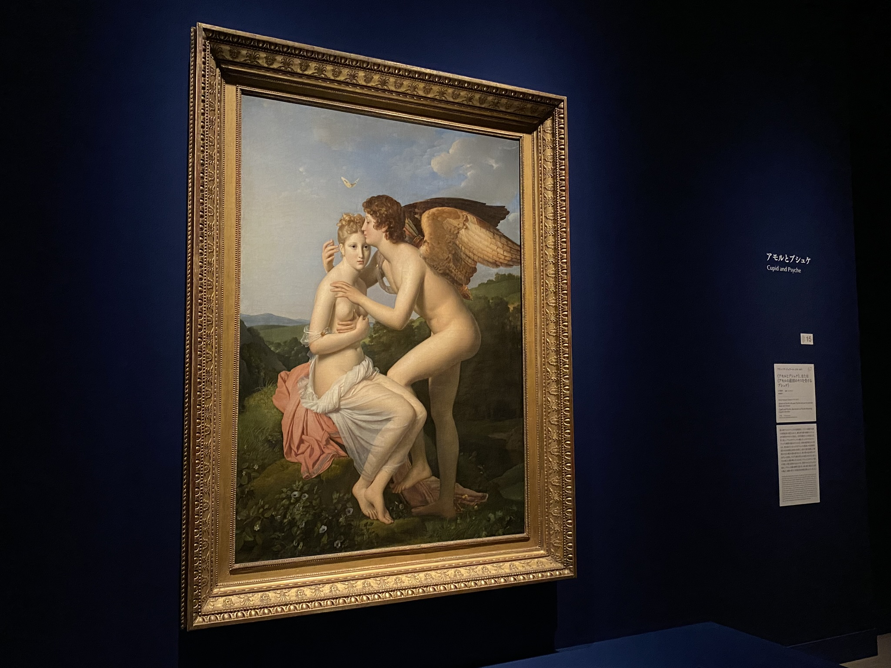
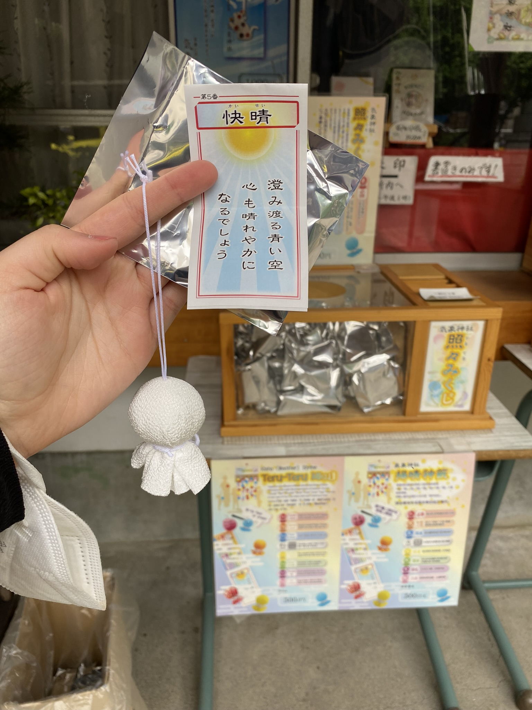

# Výstava umění z Francie, svatyně počasí a byla jsem v telce!

Proč nejít na francouzskou výstavu ve městě na druhé straně světa. Výstava Love Louvre obsahovala vypůjčené obrazy z Louvre, zobrazující různé druhy lásky. A jako vždy, skoro všude byl zákaz focení, až na jednu místnost. Každopádně výběr obrazů to byl dobrý a evropský styl hezky nostalgický. Taktéž bylo zajímavé číst popisky, neboť byly upravené pro japonské navštěvníky - často tak byly křesťanské motivy vysvětlovány víc, než jak by byly v Evropě. [Odkaz](https://www.ntv.co.jp/love_louvre/)

Poblíž stanice **Kōenji**, kterou mám na cestě do Koganei kampusu, se nachází svatyně počasí - **Kōenji Hikawa Shrine**. Je moc hezká a jak je zvykem, i tato má speciální amulety či omikuji, které jinde nemají. Já si pořídila tento hezký přípěšek pro lepší počasí a dokreslila na něj obličej (případně člověk může i napsat přání).

Mimochodem, jak jsem nedávno psala o **Nakizumo** - sumo snažící se rozbrečet děti - dostala jsem se do televize! Když jsem totiž další týden přišla na japonštinu, učitelka se mě hned zeptala, jestli jsem měla růžovou mikinu - že prý byl jednou záběr na obecenstvo a viděla mě tam! Tak uvidím, kam se dostanu příště. :D

[Zpátky](../)

