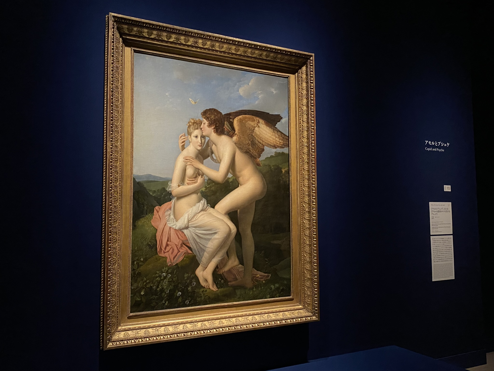
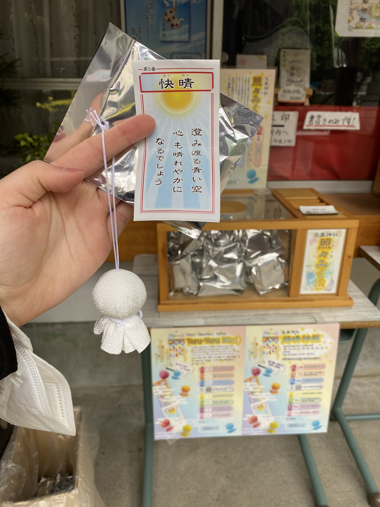

# Výstava umění z Francie, svatyně počasí a byla jsem v telce!

Proč nejít na francouzskou výstavu ve městě na druhé straně světa. Výstava Love Lourve obsahovala vypůjčené obrazy z Louvre ukazující různé druhy lásky. A jako vždy, skoro všude byl zákaz focení, až na jednu místnost. [Odkaz](https://www.ntv.co.jp/love_louvre/)

Poblíž stanice **Kōenji**, kterou mám na cestě do Koganei kampusu, se nachází svatyně počasí - **Kōenji Hikawa Shrine**. Je moc hezká a jak je zvykem, i tato má speciální amulety či omikuji, které jinde nemají. Já si pořídila tento hezký přípěšek pro lepší počasí a dokreslila na něj obličej (případně člověk může i napsat přání).

Mimochodem, jak jsem nedávno psala o Nakizumo - sumo snažící se rozbrečet děti - dostala jsem se do televize! Když jsem totiž další týden přišla na japonštinu, 

[Zpátky](../)

# Golden week část 1, baseball hra, Akabane festival a Suzume no Tojimari

Golden week je týden, kdy se sejde více státních svátků najednou - 29.4. (Den Shōwa), 3.5 (Den ústavy), 4.5 (Den zeleně) a 5.5 (Den dětí) a jak to tak bývá snad všude, většina lidí si vezme volno celý týden a někam vyrazí. A proto je taky během GW často všechno dražší (a zároveň tu jsou "Golden week slevy") a všude mnoho místních, kteří se na týden vžijou do turistů.

Přemýšlela jsem nad last-minute výletem třeba na Taiwan, ale nepřekvapivě byly letenky tento konkrétní týden mnohonásoběn dražší.

Na začátku GW byla baseballová hra mezi tokijskými univerzitami, konkrétně mezi **Hosei**, kam chodím, a **Meiji** univerzitou. Vstup jakožto studenti jsme měli zdarma a seděli jsme v oddělené části s týmem roztleskávačů, o kterých jsem zrovna nedávno tady psala. Jelikož jsme se museli částečně zapojovat (stáli jsme vždy když Hosei tým byl na pálce), často bylo velmi složité sledovat vše najednou. 

Hosei nakonec prohrál o jeden bod, ale hra to byla dobrá.

V úterý jsme se vydali do **Akabane** (znaky 赤羽, tedy "červené peří" - no není to hezké jméno? :D) na místní **Akabane Baka Festival**, něco jako aprílový průvod. Bohužel po pandemii to bylo velmi krátké, a tak jsme začali procházet okolí. Za zmínku určitě stojí **Akabane Hachiman Shrine**, která má pěkné výhledy na vlaky!

Jeden den jsme Tomomi vydaly do kina na film **Suzume no Tojimari** - bez titulků. Film jsem hrozně chtěla vidět, ale jako na potvoru jeho českou premiéru ohlásili přesně to samé ráno, co jsem seděla na letišti v Ruzyni a čekala na let do Helsinek. 

Samozřejmě naše levely japonštiny zdaleka nestačily na plné pochopení filmu, ale myslím, že tak 70-80% jsme pochytaly (vše až na ta místa kde vysvětlovali co se přesně děje :D) a bylo fakt zajímavé po filmu diskutovat co jsme pochopily a tak si doplňovat detaily.

Hodně se mi líbil koncept filmu a děj a jeho reference na skutečné události a japonský folklór. Ve filmu byla reference (ne přímo řečená, ale dost očividná) na velké zemětření v **Tóhoku** v roce 2011, kde ve filmu hlavní hrdinka ztratila maminku. Děj se odehrává po různých místech v Japonsku, především kde byly nějaká velká zemetřesení (třeba v Tokiu přesně před 100 lety), a končí právě v Tóhoku. 

Věřím, že film musel být velmi silným zážitkem pro lidi, kteří toto zemětřesení sami zažili. Bylo vidět, že film se snaží pomoct se zármutkem a jak je důležité umět vyslovit svoje pocity (což Japonci obecně neumí).

Film budou dávat i v českých kinech a doporučuji! Kdyžtak český trailer je zde: [Odkaz](https://www.youtube.com/watch?v=ctFsBSS5jIA)

Mimochodem, na filmu spolupracovat i pražský sbor! Byli v titulkách na konci filmu.

[Zpátky](../)
-------------
11
# Golden week část 2, Yosakoi festival, mořský svět a piknik

Uprostřed Golden Weeku jsem se s japonskou kamarádkou Haruna vydala do města **Kisarazu**, který leží mimo Tokio na druhé straně mostu linoucího se přes Tokijský záliv, kde se ten den konal yosakoi festival **木更津舞尊** (**Kisarazu Buson**) [Odkaz](https://kisacon.com/2023/01/22/yosakoi2023/).

Ještě před začátkem jsme prošly okolí a nejenže z dálky viděly horu Fuji, na místě se zrovna konal i sběr měkkýšů, mušlí, škeblí a kdo ví čeho, což má i název v japonštině: __shiohigari__.

Samotný festival jsme si užily, i když bylo dosti vedro. 

Ve čtvrtek jsme s kamarády využili vstup zdarma do vodního světa **Tokyo Sea Life Park** v **Kasai Rinkai Park**. I když bylo místo veeelmi narvané a plně dětí, den to byl super a zakončili jsme ho piknikem v parku poblíž.

V akvárku nechyběl ani Nemo!

[Zpátky](../)
-----------------
12
# Golden Week část 3, příroda v Chichibu, Gundam robot a Socha Svobody 

Kvůli počasí jsme trochu prohodily plány a v pátek vyrazily do Chichibu. Jedná se o místo kousek za Tokiem, kde je hezká příroda. Původně jsme plánovaly rafting, bohužel bylo málo vody, tak jsme využily menší prohlídkové jízdy (která byla až moc krátká a trochu rip-off, ale byli jsme tam jediní cizinci, takže rip-off to bylo pro všechny :D), navštívili svatyni kde jsem snad poprvé měla v omikuji __daikishi__, tedy velké štěstí, a nakonec se přemístili do parku, který na jaře krásně kvete, my však toho odbodí o pár dnů prošvihli. Celkově navíc bylo takové vedro, že jsem se už podruhé co tu jsem spálila. Každopádně, i když to byl částečně nevydařený den co se týká plánů, ve výsledku to byl fajn den.

I přes únavu jsem další den vyrazila na umělý ostrov v Tokijském zálivu Odaiba, které slouží jako zábavné centrum.

Furusato festival, Gundam, socha svobody, bon odori, aomori nebuta

[Zpátky](../)
-----------------
13
# Návrat do školy, alarm v půl 5 ráno a školní tělocvična

Návrat do školy po týdnnu volna byl, jak je zvykem, lehce krušný. Poslední dva dny spíše pršelo, tak jsem doháněla úkoly. 

Jelikož plánuji s kamarády navštěvu Ghibli muzea, desátý den v měsíci v deset hodin jsem seděla ready u počítač koupit lístky na další měsíc. Co jsem ale netušila byl ten obrovský zájem, když mi stránka řekla, že je přede mnou přes 7 000 lidí a že budu čekat přes hodinu. Po pár minutách, když jsem viděla, že se fronta nehýbe, jsem zkusila navštívit jejich japonskou verzi stránek. Světe div se, v japonštině tam žádná fronta nebyla a lístky jsem měla rezervované hned. Bylo to tím, že v této druhé verzi člověk buď musí vlastnit japonskou kartu, nebo být schopen si do 3 dnů lístky v Japonsku vyzvednout osobně. Já mohla to druhé, a hned ten den si lístky v náhodném Lawson konbini vyzvedla. 

Středa desátého byla zajímavá i v něčem jiném - během dopolední japonštiny jsme zažili menší zemětřesení o síle 2. Vyjukaná jsem lehce byla, ale výuka pokračovala dál jakoby se ta tabula vůbec nehýbala. Ještě zajímavější situace ale nastala v noci na čtvrtek, kdy v půl páté ráno vzbudily většinu lidí na koleji alarmy z mobilů, jeden mi taky u ucha zazněl. Ve městě za Tokiem, Chiba, bylo zemětřesení o síle 5, přičemž k nám se dostala síla 3. Upřímně, šla jsem ten den spát pozdě a zemětřesení přišlo v tu nejhorší noční chvíli, že když jsem se vzpamatovala z toho co že mě to vlastně vzbudilo, že některé holky na chodbě sice jančí, ale vlastně to zemětřesení tak silné není, i podle dat z aplikace Yurekuru, ulehla jsem zase zpátky do pelech.

Notifikaci jsem měla i od aplikaci **Yurekuru**, kterou Japonci používají právě pro zemětřesení. "Yure" znamená otřesy a "kuru" přijít. V logu aplikace je sumec, neboť se dříve v Japonsku věřilo, že pod zemí žije obrovský sumec **Namazu**, který je strůjcem zemětřesení. Tato teorie nabila velké popularity v roce 1855, kdy Japonsko, konkrétně Edo (tedy dnešní Tokio), zasáhlo silné zemětřesení o síle 7 (škála se v Japonsku pohybuje od 0 do 7) a přineslo mnoho obětí. Jelikož ve stejné době byla populární malba a ukiyo-e, Namazu se začal objevovat v umění, že toto umění dostalo i název **namazu-e**, a říkalo se, že obraz v domě ochrání před dalším zemětřesením. 

V aplikaci Yurekuru jsem pak mohla vidět reakce lidí (jaká byla pocitová síla), tak i reálná čísla. 

Sumec ve spojistosti se zemětřesením přetrval do dnes - na silnicích existují __Emergency road__, které jsou uzavřeny v případě silných zemětřesení, a na cedulích je spolu s popisem vyobrazen právě sumec. Více třeba tady: [Odkaz](https://sabukaru.online/articles/namazu-the-ancient-history-behind-the-earthquake-causing-catfish)

Jedna z věcí, co mně i ostatním ESOP studentům celkem chybí, jsou naše pohybové aktivity. Takže občas navštevujeme školní posilku a nebo nás kamarádka učila základy na provazu či akrobacie. Taktéž jsme navštívili trénink karate klubu.

[Zpátky](../)

