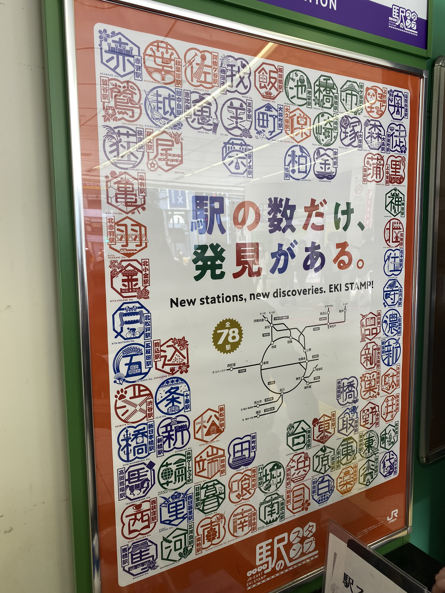

# 11(?) random faktů/zajímavostí nejen o Tokiu

Nestále-aktualizovný seznam pár náhodných věcí, která mi přijdou obecně zajímavá/jiná/prostě náhodná.

1. Japonci neustále děkují. A to i ve vlacích/metru, že využíváte jejich služeb. Prostě, všude.
2. Semafory, když je zelená, začnou hrát různé melodie, které se v různých částech Japonska mohou lehce lišit (verzí/typem). V Tokiu slyším hlavně zvuk ptáků, tuhle: [Youtube](https://youtu.be/F-7k2y-mXAw?t=87)
3. Když člověk najde v mapách obchod, kam se chce podívat, je dobré si najít i patro. Obchody běžně využívají každého možného prostoru, tedy není to jako v ČR, že by člověk našel cíl jen dle dívání se na to, co je v přízemí.
4. Když už jsme u těch pater, zde je přízemí první patro, tj. 1F. Proto pokud je obchod na 2F, člověk musí jednou po schodech/ekalátorech nahoru.
5. Vlaky nejezdí přesně na čas, pokud je řeč o těch lokálních v Tokiu. Lehce se stane, že je doprava pozastavena kvůli zranění/závadě/něčemu jinému. Už se mi stalo, že jsem přišla na stanici a zjistila, že minimálně půl hodiny vlak nepojede, kvůli "personal injury".
6. Akihabara je safra rušná stanice (a pro mnoho lidí také přestupní). Jezdím přes ní každý den do školy a to vždy tak tři čtvrtě vlaku vystoupí a zase nastoupí. V rush hours pak často lidi musí čekat na další vlak (a to jezdí i co 2 minuty).
7. Bezkontaktní platba kartou tu stále není všude, a to ani po pandemii. Obecně mi přijde, že i v ČR může člověk platit na více místech bezkontaktně než tady.
8. Viděla jsem více psů v kočárcích než dětí v kočárcích.
9. Děti ze školky se na procházky doslova vozí. Ve vozíku, který tahají učitelky.
10. Je tu super dostupnost čistých veřejných záchodů (a většina z nich je chytřejších než většina záchodů v ČR).
11. Razítka! Všemožná razítka se dají najít na stanicích vlaků, u památek v kulturních centrech či za poplatek i v svatyních (a že jsou nádherná!).

[Zpátky](../)
